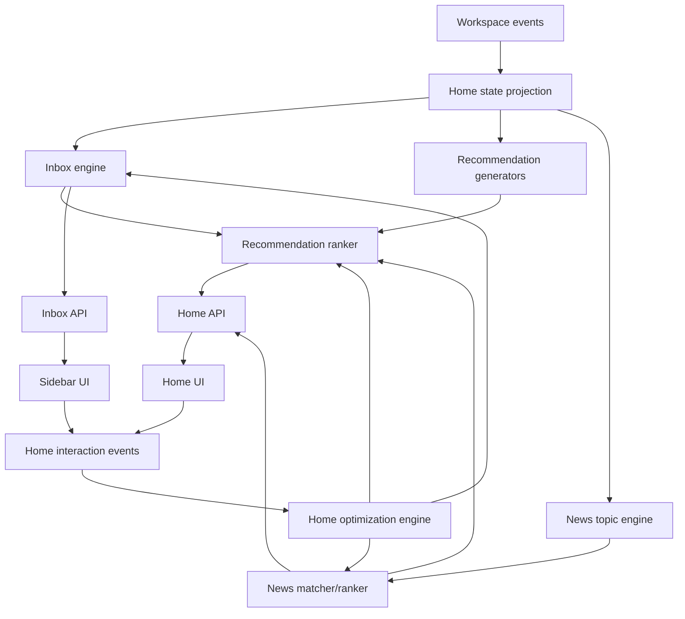
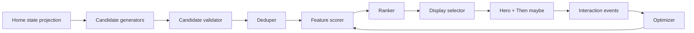

# ClawTalk Homepage System Design

This doc specifies the production architecture for the ClawTalk Home page,
sidebar Inbox behavior, recommendations, News, and the feedback loops that make
those systems improve over time.

The main decision: Home is not a dashboard and not a marketing page. Home is
the user's attention router. It should answer:

```text
What deserves my attention now?
```

That breaks into three different systems:

- Recommendations: what should I do next inside ClawTalk?
- News: what changed outside ClawTalk that may affect my Talks?
- Inbox: what arrived, changed, failed, or is waiting for me?

Do not make an LLM Curator the source of truth for Home. Use deterministic,
auditable systems for state, candidates, scores, and actions. Use models later
for summarization, copy polish, clustering, and proposal generation.

## 1. Product Goals

Home should help the user:

- resume important work quickly
- notice blocked or stale Talks
- convert agent debate into concrete actions
- add relevant external context without hunting for it
- keep the workspace organized with minimal filing work
- trust why each surfaced item appears

Home should not:

- become a generic activity feed
- become a generic news product
- show arbitrary LLM-generated suggestions
- require prompt engineering or tuning from the user
- nag the user with low-value cleanup
- hide provenance

## 2. Current Spec Evaluation

The current rebuild plan is directionally strong but needs sharper boundaries.

### 2.1 Recommendations

Current strengths:

- cards have provenance
- actions are structured
- candidate kinds are concrete
- deterministic-first generation is the right v1 path
- dismissed/completed/expired lifecycle is correct

Current weaknesses:

- scoring overweights static `kind_base`
- older Curator-centered assumptions treated a model call as the generator, which
  conflicts with deterministic-first architecture
- expected action value is not defined
- user feedback affects ranking only loosely
- no clear separation between candidate generation, ranking, display, and copy
  rewrite

Conclusion:

Recommendations should be the Home page's primary system. They should optimize
for completed useful actions, not for interesting cards.

### 2.2 News

Current strengths:

- News is scoped to Talks with News monitor enabled
- privacy contract is explicit
- "Add to context" is a strong action
- source and Talk provenance are required

Current risks:

- users may want either decision-changing context or a lightweight topic feed
- search/source strategy can become broad without user preference signals
- scoring should distinguish "useful for the Talk" from "interesting to follow"
  without assuming only one is valuable
- success should include downstream Talk usefulness and direct News engagement
- the system needs to learn whether the user treats a topic as work context,
  ambient monitoring, or both

Conclusion:

News should be a topic-aware monitoring surface for opted-in Talks. Some items
will change a Talk's assumptions or next step. Other items may simply be useful
or engaging because the user created or opted into that topic. V1 should support
both modes and let explicit feedback plus observed behavior tune the balance.

### 2.3 Inbox

Current strengths:

- the prototype correctly suggests that users need a place for things requiring
  attention
- state badges can be tied to real Talk/doc/run state
- the surface is near the user's main work navigation

Current weaknesses:

- defining Inbox as `folder_id is null` confuses organization with attention
- a Talk is not an Inbox item; it is a durable workspace object
- folders already solve Talk organization
- recommendations already solve broad "what should I do next?"
- unfiled Talks inside an Inbox create a second folder model with a worse name

Conclusion:

Redefine Inbox from zero:

- Inbox = an actionable queue of arrivals, blockers, and waiting states.
- Unfiled = Talks with no folder.
- Folders/Unfiled organize Talks.
- Recommendations suggest high-leverage next actions.
- Inbox captures concrete events that arrived or need acknowledgement.

An Inbox item may point to a Talk, document, run, message, connector, News item,
or future job. It is never the Talk itself.

## 3. System Architecture

Home should be built from independent modules with stable contracts.



Modules:

- `home-state`: denormalized projection of workspace/Talk/doc/run state.
- `talk-organizer`: folders, Unfiled, sidebar search, row ordering.
- `inbox-engine`: arrivals, blockers, and waiting states.
- `recommendation-engine`: candidates, scoring, ranking, actions.
- `news-monitor`: topics, search, matching, ranking, source feedback.
- `home-feedback`: impressions, clicks, dismisses, snoozes, completions.
- `home-optimizer`: automatic preference/weight tuning plus admin-reviewed
  algorithm proposals.
- `home-algorithm-registry`: versioned strategies for candidate generation,
  scoring, ranking, matching, thresholds, and display selection.

The UI should not know whether a title or why-line was generated
deterministically or model-polished. It should receive structured cards with
provenance and actions.

### 3.1 Algorithm Strategy Boundary

Recommendation and News algorithms must not be hard-coded into UI components or
spread across ad hoc services. They should be loaded through versioned strategy
interfaces.

The v1 formulas in this doc are default strategies. They are not permanent
product law.

```ts
type HomeAlgorithmVersion = {
  id: string;                 // e.g. rec_ranker_v1_weighted
  surface: 'recommendations' | 'news' | 'inbox' | 'search';
  status: 'draft' | 'staging' | 'active' | 'paused' | 'retired';
  configHash: string;
  description: string;
  rollout: {
    workspaceIds?: string[];
    percentage?: number;
    startedAt?: string;
    endedAt?: string;
  };
};
```

Strategy interfaces:

```ts
type RecommendationStrategy = {
  version: HomeAlgorithmVersion;
  generateCandidates(state: HomeState): RecommendationCandidate[];
  validate(candidate: RecommendationCandidate, state: HomeState): boolean;
  score(candidate: RecommendationCandidate, state: HomeState): number;
  select(scored: ScoredRecommendation[], state: HomeState): RankedRecommendations;
};

type NewsStrategy = {
  version: HomeAlgorithmVersion;
  buildTopics(state: HomeState): HomeNewsTopic[];
  buildQueries(topic: HomeNewsTopic): NewsQuery[];
  classify(item: NewsItem, topic: HomeNewsTopic): HomeNewsMatch;
  score(match: HomeNewsMatch, item: NewsItem, topic: HomeNewsTopic, state: HomeState): number;
  select(matches: ScoredNewsMatch[], state: HomeState): ScoredNewsMatch[];
};

type InboxStrategy = {
  version: HomeAlgorithmVersion;
  generate(state: HomeState): InboxItem[];
  score(item: InboxItem, state: HomeState): number;
  group(items: InboxItem[], state: HomeState): InboxGroup[];
  resolve(event: ActivityEvent, activeItems: InboxItem[]): InboxResolution[];
};
```

Rules:

- Every generated recommendation, News match, and Inbox item stores the
  algorithm version that created or ranked it.
- Strategy configs live in versioned config files or database rows, not scattered
  constants.
- The UI consumes only API output and `algorithmVersion`; it never imports a
  strategy implementation.
- New strategies can run in shadow mode before becoming active.
- Rollback means switching the active strategy version and re-ranking cached
  candidates, not a data migration.
- Structural strategy changes require admin review or explicit release approval.

## 4. Home Layout

Use the `HomeFocus` prototype as the default visual layout.

Top-to-bottom:

1. Top bar search and New Talk.
2. Greeting.
3. Curator summary and stat strip.
4. Quick composer.
5. `Do this next` recommendation hero.
6. `Then maybe` follow-up recommendations.
7. `News for your Talks`.

V1 should not expose Home layout tweaks. The split/feed prototypes remain design
references only.

### 4.1 Curator Summary

The Curator summary is a headline over deterministic state, not the source of
truth for recommendations.

Priority order:

1. Running Talk with visible progress.
2. Highest-scoring recommendation.
3. Highest-severity Inbox item.
4. Fresh high-impact News match.
5. Idle workspace prompt to start a Talk.

Optional model use:

- rewrite the headline for clarity
- cluster similar events
- produce a warmer but still factual sentence

Do not let the model invent state.

### 4.2 Stat Strip

V1 stat cards:

- Talks
- Prompts
- Tokens
- Words

Rules:

- stats are deterministic
- stats are not recommendations
- clicking a stat can open a filtered view later, but v1 can keep them read-only

## 5. Event Model

Home quality depends on a clean event model.

### 5.1 Activity Events

`activity_events` are append-only facts.

Examples:

- `run.started`
- `run.completed`
- `run.failed`
- `round.completed`
- `doc.pending_edit_created`
- `doc.edit_accepted`
- `doc.edit_rejected`
- `connector.auth_required`
- `news.matched`
- `news.added_to_context`
- `recommendation.created`
- `recommendation.completed`
- `talk.archived`
- `talk.moved_to_folder`
- `talk.viewed`

These power stats, sidebar badges, Inbox items, and recommendations.

### 5.2 Home Interaction Events

`home_interaction_events` record how the user reacts to Home surfaces.

Events:

- `home.impression`
- `home.card_opened`
- `home.card_action_clicked`
- `home.card_action_completed`
- `home.card_dismissed`
- `home.card_snoozed`
- `home.card_not_relevant`
- `home.card_more_like_this`
- `home.card_less_like_this`
- `home.news_opened`
- `home.news_added_to_context`
- `home.news_snoozed`
- `home.news_not_relevant`
- `home.inbox_viewed`
- `home.inbox_item_opened`
- `home.inbox_item_action_clicked`
- `home.inbox_item_resolved`
- `home.inbox_item_dismissed`
- `home.inbox_item_snoozed`
- `home.inbox_item_marked_read`

Every event should include:

- workspace id
- surface: recommendation, news, inbox, search
- item id
- Talk/doc/source ids when present
- rank/position at time of impression
- algorithm version
- feature score snapshot when useful
- timestamp

## 6. Inbox

### 6.1 First-Principles Model

Inbox is not where Talks live. Talks live in the Talk hierarchy: folders plus
Unfiled.

Inbox is where **arrivals and waits** land.

A good Inbox answers:

```text
What changed while I was away, failed, needs my acknowledgement, or is waiting
on me?
```

The product has three separate surfaces:

| Surface | Owns | Example |
|---|---|---|
| Folders / Unfiled | Talk organization | `Pricing`, `Hiring`, `Unfiled` |
| Inbox | Incoming or waiting items | `Editor is waiting on your answer` |
| Recommendations | Higher-leverage next actions | `Ask Quant to compare API vs local hardware cost` |

A Talk may be the target of an Inbox item, but a Talk is not itself an Inbox
item.

### 6.2 Definitions

Unfiled Talk:

```text
A Talk where talks.folder_id is null and talks.archived_at is null.
```

Inbox item:

```text
A user-visible, resolvable item generated from a state transition that arrived,
failed, blocked progress, or is waiting for acknowledgement/action.
```

This separation matters because:

- a Talk can be filed in a folder and still produce Inbox items
- a Talk can be Unfiled with no Inbox items
- a document can produce Inbox items without being a Talk row
- a connector can produce Inbox items before the user opens any Talk
- a recommendation can be useful without being an Inbox item

### 6.3 Product Contract

V1 objectives:

- show new agent work the user has not seen
- surface blockers that stop a Talk from completing
- collect document edits waiting for review
- make failed or long-running runs visible without hunting
- acknowledge context or News that was added to a Talk
- give the user a compact queue of what arrived since their last session

V1 non-goals:

- no Talk-as-Inbox-item model
- no folderless-Talk queue called Inbox
- no generic notification firehose
- no recommendations that appear only because they are interesting
- no social-feed behavior
- no auto-filing, auto-archiving, or hidden Talk movement

### 6.4 Relationship To Folders And Unfiled

Talk organization:

```text
Folders
  Pricing
  Hiring
Unfiled
  Talks with folder_id null
```

Inbox:

```text
Inbox
  Round completed in Pricing v2
  Editor is waiting on an answer in Hiring loop
  Review 2 edits in pricing-v2-draft.md
  Researcher failed in Cal Football
```

Rules:

- `folder_id is null` means Unfiled, not Inbox.
- Unfiled belongs in the Talks sidebar or Talk list filter.
- Inbox can reference any Talk, whether filed or Unfiled.
- Moving a Talk to a folder does not resolve its Inbox items.
- Resolving an Inbox item does not move the Talk.
- Folder badges may show counts of active Inbox items for Talks inside that
  folder.

### 6.5 Inbox Item Schema

```ts
type InboxItemType =
  | 'agent_replied'
  | 'round_completed'
  | 'agent_asks_user'
  | 'run_failed'
  | 'doc_edits_ready'
  | 'connector_needs_auth'
  | 'news_context_added'
  | 'long_running_run'
  | 'system_limit_reached'
  | 'job_needs_review'; // reserved for future scheduled jobs

type InboxTarget =
  | { kind: 'talk'; talkId: string; messageId?: string; runId?: string }
  | { kind: 'document'; documentId: string; tabId?: string; editIds?: string[] }
  | { kind: 'connector'; connectorId: string; service: string }
  | { kind: 'news'; newsItemId: string; talkId: string }
  | { kind: 'job'; jobId: string; talkId?: string }
  | { kind: 'system'; area: 'billing' | 'api_keys' | 'provider' | 'workspace' };

type InboxAction = {
  type:
    | 'open_talk'
    | 'open_at_message'
    | 'review_doc_edits'
    | 'retry_run'
    | 'cancel_run'
    | 'connect_service'
    | 'open_context'
    | 'mark_read'
    | 'dismiss'
    | 'snooze';
  label: string;
  payload: Record<string, unknown>;
};

type InboxItem = {
  id: string;
  workspaceId: string;
  type: InboxItemType;
  target: InboxTarget;
  severity: 'info' | 'action' | 'blocking';
  status: 'unread' | 'read' | 'resolved' | 'dismissed' | 'snoozed' | 'expired';
  title: string;
  summary: string;
  reason: string;
  primaryAction: InboxAction;
  secondaryActions: InboxAction[];
  sourceEventIds: string[];
  groupKey: string;
  score: number;
  algorithmVersion: string;
  createdAt: string;
  updatedAt: string;
  dueAt?: string;
  snoozedUntil?: string;
  resolvedAt?: string;
  expiresAt?: string;
};
```

### 6.6 V1 Inbox Item Types

Each Inbox item type must have a deterministic trigger and resolution rule.

#### `round_completed`

Use when a round finishes while the user is not viewing the Talk.

Trigger:

- a Talk round transitions to `completed`
- user has not viewed the Talk since the round completed
- at least one agent message was committed

Visible example:

- Title: `Round 3 finished in Pricing v2`
- Summary: `Strategy Lead, Critic, Quant, and Editor responded.`
- Reason: `Editor closed the round with a recommendation after you left.`
- Primary action: `Open Talk`

Severity:

- `action` when Editor produced a recommendation or pending edits
- `info` otherwise

Resolution:

- user opens the Talk
- user marks item read
- Talk is archived

Grouping:

- group all agent messages from the same completed round into one item
- do not create separate `agent_replied` items for the same round

#### `agent_replied`

Use only when an agent reply arrives outside a completed round, or while a round
is still in progress and the partial response matters.

Trigger:

- agent message commits after `talk_user_state.last_viewed_at`
- round is not completed yet, or the message is a direct answer to the user

Visible example:

- Title: `Researcher replied in Cal Football`
- Summary: `Researcher found three transfer portal updates.`
- Reason: `This arrived after your last view.`
- Primary action: `Open Talk`

Severity:

- `info`
- `action` if the message contains a structured request or decision point

Resolution:

- user opens the Talk
- user marks item read
- superseded by `round_completed` for the same round

#### `agent_asks_user`

Use when progress is waiting on user input.

Trigger:

- latest agent message includes a structured clarification request
- run or round state is `awaiting_user`
- no later user message exists in the Talk

Visible example:

- Title: `Editor is waiting on you`
- Summary: `Editor asked whether the goal is revenue expansion or churn reduction.`
- Reason: `The round cannot synthesize until you answer.`
- Primary action: `Reply`

Severity:

- `blocking`

Resolution:

- user sends a message in the Talk
- user dismisses the question
- user cancels the waiting run

#### `run_failed`

Use when an agent run fails and the failure affects a visible Talk.

Trigger:

- `runs.status = 'failed'`
- run belongs to an unarchived Talk
- failure has not been retried, dismissed, or superseded by a later successful run
  for the same agent/round

Visible example:

- Title: `Researcher failed in Pricing v2`
- Summary: `Provider rate limited the run.`
- Reason: `The round is incomplete until you retry, skip, or cancel.`
- Primary action: `Retry`

Severity:

- `blocking` when the failed run blocks an active round or Editor synthesis
- `action` otherwise

Resolution:

- retry succeeds
- user cancels the run
- user dismisses the failure
- a later round supersedes the failed run

#### `doc_edits_ready`

Use when a primary document has pending edits ready for review.

Trigger:

- primary document has one or more `doc_edits.status = 'pending'`
- edits are older than two minutes
- user is not currently reviewing that document

Visible example:

- Title: `Review 2 edits to pricing-v2-draft.md`
- Summary: `Editor proposed a recommendation paragraph and a risk note.`
- Reason: `The draft will not change until you accept or reject the edits.`
- Primary action: `Review edits`

Severity:

- `action`

Resolution:

- all pending edits in the item are accepted or rejected
- document is deleted
- Talk is archived and document is unlinked/deleted

Grouping:

- group by `documentId`
- include tab-level counts when document tabs are involved

#### `connector_needs_auth`

Use when a Talk cannot use an enabled tool because a connector needs action.

Trigger:

- Talk has an enabled tool requiring a connector
- connector is missing, expired, revoked, or lacks required scope
- a queued, running, or recent run needs that connector

Visible example:

- Title: `Connect Google Drive for Researcher`
- Summary: `Researcher cannot read the attached Drive source.`
- Reason: `Drive access is required before the source can be used.`
- Primary action: `Connect Drive`

Severity:

- `blocking` when it blocks a run
- `action` when it blocks only an optional tool

Resolution:

- connector authorization succeeds with required scope
- tool is disabled for the Talk
- run is cancelled or completed without the connector

#### `news_context_added`

Use when a News item has been added to a Talk as context and the user has not
seen the updated Talk yet.

Trigger:

- user clicks `Add to context` on a News item, or a future approved job adds News
  context
- context source is added to the Talk
- Talk has not been opened since the add

Visible example:

- Title: `New context added to Pricing v2`
- Summary: `Notion pricing update was added as a source.`
- Reason: `The next round can now use this source.`
- Primary action: `Open context`

Severity:

- `info`

Resolution:

- user opens the Talk
- user starts a new round using that context
- user removes the context source

#### `long_running_run`

Use when a queued or running agent is taking longer than expected.

Trigger:

- run is still `queued` or `running` beyond threshold
- no newer run supersedes it

Default thresholds:

- queued > 30 seconds
- running with no first token > 20 seconds
- running total > 90 seconds

Visible example:

- Title: `Researcher is still running`
- Summary: `No first token after 24 seconds.`
- Reason: `The provider may be slow or stuck.`
- Primary action: `Open Talk`

Severity:

- `info` before 90 seconds
- `action` after 90 seconds
- `blocking` if the user explicitly waits on the result for Editor synthesis

Resolution:

- run completes
- run fails
- user cancels
- worker marks timeout

#### `system_limit_reached`

Use when the user cannot proceed because of a workspace/provider limit.

Trigger examples:

- no API key or hosted provider access available when trying to run agents
- model provider quota exhausted
- workspace token/rate limit reached

Visible example:

- Title: `Add an API key to run agents`
- Summary: `ClawTalk needs model access before the room can respond.`
- Reason: `The first run is blocked until a provider key is configured.`
- Primary action: `Add API key`

Severity:

- `blocking` when the user is actively trying to run agents
- `action` otherwise

Resolution:

- user configures provider access
- user dismisses the setup item after choosing not to run agents

#### `job_needs_review`

Reserved for future scheduled jobs. Do not implement the job engine in v1 unless
that scope changes.

Example future item:

- Title: `Daily Cal Football scan is ready`
- Summary: `5 new source matches were found.`
- Primary action: `Review results`

### 6.7 Items That Do Not Belong In Inbox

Do not create Inbox items for:

- a Talk merely being Unfiled
- a stale Talk with no concrete unresolved state
- generic cleanup suggestions
- generic prompt ideas
- News cards that the user has not acted on
- recommendations such as adding/removing agents
- a folder having many Talks

Those belong in folders/Unfiled, Recommendations, or News.

### 6.8 Inbox Display

Inbox appears as a user-facing queue in Home and may have a compact nav affordance
in the shell. It should not be nested under Talk folders.

Required UI elements:

- unread/action count badge
- item title
- target chip such as `Pricing v2`, `pricing-v2-draft.md`, or `Google Drive`
- severity badge: `info`, `action`, or `blocking`
- age such as `12m`, `3h`, `yesterday`
- primary action button
- overflow actions for mark read, snooze, dismiss when allowed

Default Home Inbox preview:

- show top 5 active items
- show `View all` when more exist
- sort by Inbox score
- group related items by target when grouping improves scanability

Empty state:

- hide the Inbox preview when there are no active items and the workspace is not
  in FTUE
- during FTUE, setup blockers may appear as Inbox items only when they block an
  attempted action; otherwise setup belongs in hero recommendations

### 6.9 Inbox Ranking Algorithm

Inbox ranking optimizes for urgency, not interest.

Bucket order:

1. Blocking user action required.
2. Failed or blocked runs.
3. Document edits waiting for review.
4. Completed agent work the user has not seen.
5. Informational context updates.
6. Slow-running work.

Score:

```text
inbox_score =
  severity_weight
  + action_required_weight
  + freshness_weight
  + target_importance_weight
  + waiting_time_weight
  - repeated_exposure_penalty
  - snooze_penalty
```

Default weights:

```ts
const inboxScoreWeights = {
  blocking: 120,
  action: 80,
  info: 35,
  requiresUserInput: 35,
  failedRun: 30,
  pendingDocEdits: 20,
  unseenRoundCompleted: 18,
  newsContextAdded: 8,
  longRunning: 12,
  targetOpenedLast7Days: 12,
  primaryDocumentTarget: 6,
  repeatedExposurePenalty: 15,
};
```

Freshness:

```ts
function inboxFreshnessWeight(createdAt: Date, now: Date): number {
  const hours = hoursBetween(createdAt, now);
  if (hours <= 1) return 35;
  if (hours <= 6) return 28;
  if (hours <= 24) return 20;
  if (hours <= 72) return 10;
  return 2;
}
```

Waiting-time boost:

- `agent_asks_user`: +5 after 30 minutes, +15 after 24 hours
- `doc_edits_ready`: +5 after 24 hours
- `run_failed`: +10 while it blocks an active round
- `long_running_run`: increases only until it turns into failed/completed/cancelled

Tie-breakers:

1. severity
2. `created_at desc`
3. target last activity
4. title asc

### 6.10 Grouping And Dedupe

Grouping rules:

- group all messages from one completed round into one `round_completed` item
- group doc edits by document, and show tab counts when relevant
- group repeated connector failures by connector and Talk
- replace `long_running_run` with `run_failed` if the run fails
- suppress `agent_replied` items when a `round_completed` item exists for the same
  Talk/round
- update the existing active item rather than creating duplicates when the same
  source event recurs

Group key examples:

```text
round_completed:t_pricing:round_3
doc_edits_ready:d_pricing
run_failed:t_pricing:run_123
connector_needs_auth:t_research:gdrive
```

### 6.11 Lifecycle

Statuses:

- `unread`: created and not yet opened/read
- `read`: acknowledged, but not necessarily resolved
- `resolved`: underlying state no longer needs attention
- `dismissed`: user explicitly dismissed the item
- `snoozed`: hidden until `snoozed_until`
- `expired`: no longer relevant because state aged out or was superseded

Resolution rules:

- opening a Talk resolves `round_completed` and `agent_replied`
- replying resolves `agent_asks_user`
- retrying/cancelling/dismissing/superseding resolves `run_failed`
- accepting/rejecting edits resolves `doc_edits_ready`
- completing OAuth resolves `connector_needs_auth`
- opening the Talk or context resolves `news_context_added`
- completion/cancel/failure resolves `long_running_run`
- fixing provider/key/quota state resolves `system_limit_reached`

Do not resolve blocking items merely because the user saw them. Viewing can mark
an item read, but resolution requires the underlying state to change or an
explicit dismiss action.

### 6.12 Inbox And Recommendations

Inbox and Recommendations can reference the same underlying state, but they serve
different jobs.

Inbox item:

```text
Researcher failed in Pricing v2.
```

Recommendation:

```text
Retry Researcher so Editor can complete the pricing recommendation.
```

Rules:

- Inbox records the concrete arrival/blocker.
- Recommendation decides whether that state deserves hero/follow-up treatment.
- A recommendation may cite an `inboxItemId` as provenance.
- Dismissing a recommendation does not automatically resolve the Inbox item.
- Resolving the Inbox item should complete or expire related recommendations.

Recommendation bridges:

- `run_failed` blocking item -> `failed-run` recommendation
- `agent_asks_user` older than 10 minutes -> `unresolved` recommendation
- `doc_edits_ready` older than 10 minutes -> `pending-edit` recommendation
- repeated `long_running_run` or failures -> provider/tool recommendation

### 6.13 Inbox And Folders

Folders can display aggregate Inbox badges without becoming Inbox.

Folder badge rules:

- count active `blocking` and `action` Inbox items for Talks in that folder
- do not count `info` by default
- clicking a folder badge can filter Inbox to that folder's targets
- Unfiled can also show an aggregate badge for Unfiled Talks with active Inbox
  items

Unfiled rules:

- Unfiled is the null-folder Talk list
- Unfiled can be shown below folders in the Talk sidebar
- Unfiled is hidden when empty
- moving a Talk into a folder removes it from Unfiled, not from Inbox

### 6.14 Inbox Events

Emit interaction events:

- `home.inbox_viewed`
- `home.inbox_item_opened`
- `home.inbox_item_action_clicked`
- `home.inbox_item_resolved`
- `home.inbox_item_dismissed`
- `home.inbox_item_snoozed`
- `home.inbox_item_marked_read`
- `home.inbox_filtered_by_folder`

Event payload:

```ts
{
  workspaceId: string;
  inboxItemId?: string;
  targetKind?: InboxTarget['kind'];
  targetId?: string;
  folderId?: string;
  itemType?: InboxItemType;
  severity?: InboxItem['severity'];
  rank?: number;
  score?: number;
  algorithmVersion: string;
  createdAt: string;
}
```

### 6.15 Optimization Boundaries

Automatic optimization may tune:

- Inbox item ranking weights within bounded ranges
- grouping thresholds
- expiration thresholds for info items
- snooze defaults
- whether folder badges count `info` items
- whether Home shows 3, 5, or 8 preview items

Automatic optimization may not:

- redefine Inbox as Unfiled Talks
- auto-file Talks
- auto-archive Talks
- hide blocking items
- generate speculative Inbox items that did not come from a concrete state
  transition
- create new item types without admin-reviewed strategy approval

### 6.16 API Contract Summary

```ts
GET /home/inbox?status=active&limit=20&cursor=
```

Returns:

```ts
{
  items: InboxItem[];
  counts: {
    unread: number;
    blocking: number;
    action: number;
    info: number;
  };
  nextCursor: string | null;
  algorithmVersion: string;
}
```

Actions:

```text
POST /home/inbox/:id/read
POST /home/inbox/:id/resolve
POST /home/inbox/:id/dismiss
POST /home/inbox/:id/snooze
POST /home/inbox/:id/action
```

`GET /talks?folder=unfiled` returns Unfiled Talks. Do not use
`GET /home/inbox` to return Talk rows.

### 6.17 Acceptance Tests

Unit tests:

- Unfiled Talk does not create an Inbox item by itself.
- Filed Talk can produce an Inbox item.
- Unfiled Talk can produce an Inbox item.
- `round_completed` groups all agent replies in one round.
- `agent_replied` is suppressed when `round_completed` exists for same round.
- `run_failed` replaces related `long_running_run`.
- `doc_edits_ready` groups pending edits by document.
- Opening a Talk resolves `round_completed` but not `agent_asks_user`.
- Replying resolves `agent_asks_user`.
- Accepting/rejecting all edits resolves `doc_edits_ready`.
- Moving a Talk to a folder does not resolve its Inbox items.
- Resolving an Inbox item does not move a Talk.

Browser QA:

- Inbox preview shows item rows, not Talk rows.
- Inbox item target chip opens the correct Talk/document/context.
- Folder badges count active blocking/action Inbox items.
- Unfiled appears as organization, not as Inbox.
- Empty Inbox hides or shows a quiet empty state without showing Unfiled Talks.
- Recommendation can cite an Inbox item, and resolving the item expires the
  recommendation.

## 7. Recommendations

### 7.1 Objective

Recommendations should convert workspace state into the next useful action.

They should answer:

- what should I do?
- why now?
- what Talk/doc/source caused this?
- what exactly happens if I click?

### 7.2 Success Metrics

Primary:

- action completion rate
- follow-up Talk continuation rate
- useful dismiss ratio: dismissed because done/irrelevant vs ignored
- recommendation-to-value rate: doc created, synthesis run, context added,
  failed run retried, unresolved issue answered

Secondary:

- open rate
- time from recommendation shown to action
- repeated exposure without action
- card not-relevant rate
- low-value cleanup suppression

### 7.3 Non-Goals

Recommendations should not:

- be an LLM brainstorming list
- show cards without structured actions
- show cards without provenance
- optimize for clicks alone
- repeatedly nag on cleanup when high-value work exists

### 7.4 Architecture

Pipeline:



Core tables:

- `home_recommendation_candidates`
- `home_recommendations`
- `home_recommendation_events`
- `home_recommendation_actions`
- `home_ranking_profiles`
- `home_activation_state`

### 7.5 Recommendation Schema

```ts
type HomeRecommendation = {
  id: string;
  workspaceId: string;
  kind: RecommendationKind;
  title: string;
  why: string;
  priority: 'decide' | 'improve' | 'tidy';
  score: number;
  confidence: number; // 0-1
  effort: 'low' | 'medium' | 'high';
  provenance: {
    talkId?: string;
    relatedTalkId?: string;
    documentId?: string;
    messageId?: string;
    runId?: string;
    blockId?: string;
    newsItemId?: string;
    inboxItemId?: string;
  };
  action: RecommendationAction;
  status: 'active' | 'dismissed' | 'completed' | 'expired' | 'snoozed';
  stateFingerprint: string;
  algorithmVersion: string;
  createdAt: string;
  expiresAt: string;
};
```

### 7.6 Candidate Kinds

V1 kinds:

- `setup`: first-time setup, onboarding, and activation steps.
- `failed-run`: retry or inspect a failed run.
- `unresolved`: answer an unresolved objection/question.
- `synthesis`: run Editor or synthesize a round.
- `pending-edit`: review pending document edits.
- `doc`: draft a decision doc from a mature Talk.
- `cross-link`: add a related Talk/doc as context.
- `tool`: enable a missing tool or connect a service.
- `news-context`: add a high-impact News item to a Talk.
- `agent-change`: add, remove, swap, or tune an agent/team for better future
  rounds.
- `job`: add a recurring job for a Talk pattern the user appears to want.
- `prompt-suggestion`: suggest a high-leverage next question for the room.
- `recap`: generate a recap for a stale but still valuable Talk.
- `archive-cleanup`: archive or file low-value stale Inbox work.

### 7.7 Candidate Generator Rules

Each generator must emit:

- structured action
- provenance
- reason
- confidence
- state fingerprint
- expiration rule

`setup`:

- trigger: workspace/user has not completed required or recommended activation
  steps
- action: setup-specific structured action such as `add_api_key`,
  `start_talk`, `customize_agent`, `add_agent_to_talk`, or `create_document`
- should dominate Hero during first-time user experience until the workspace can
  successfully run its first Talk

`failed-run`:

- trigger: recent active Talk has failed run
- action: `retry_run` or `open_run_error`
- high value when failure blocks a round

`unresolved`:

- trigger: Critic objection, Editor open question, or repeated TODO remains
  unresolved after later turns
- action: `open_at_message` or `ask_followup`
- needs a claim/question extraction pass

`synthesis`:

- trigger: multiple agent replies but no Editor synthesis, or Editor failed
- action: `run_synthesis`
- should outrank recap when the Talk is fresh

`pending-edit`:

- trigger: primary document has pending edits older than 10 minutes
- action: `review_doc_edits`
- should not appear if user is currently editing the doc

`doc`:

- trigger: Talk has enough substance and no primary document
- action: `draft_doc`
- confidence rises with rounds, messages, explicit decision language, and Editor
  output

`cross-link`:

- trigger: two Talks/docs share entities, sources, or one references content in
  another
- action: `add_context` or `link_related_talk`
- needs strong provenance to avoid spooky suggestions

`tool`:

- trigger: agent requested unavailable capability or run failed due to missing
  connector/tool
- action: `enable_tool` or `connect_service`
- should be blocking only when a live Talk needs it

`news-context`:

- trigger: high-impact News match for active Talk
- action: `add_context`
- should cite the concrete assumption or topic it affects

`agent-change`:

- trigger: periodic review finds a missing perspective, low-value agent, model
  mismatch, persona/method issue, or repeated ad hoc roster pattern
- action: `suggest_agent_change`, `save_team`, or `open_agent_profile`
- should be shown sparingly because it changes the user's workspace setup

`job`:

- trigger: user repeatedly uses a Talk as a monitoring surface or asks for
  periodic updates
- action: `create_job_draft`
- should require explicit user confirmation before scheduling anything
- v1 scope note: if user-visible recurring jobs remain out of scope, this card
  creates a saved draft/proposal only and is hidden unless the jobs feature flag
  is enabled

`prompt-suggestion`:

- trigger: audit finds an unresolved high-value angle that the user has not
  asked yet
- action: `insert_prompt` or `ask_followup`
- should be concrete enough that clicking it can populate the composer

`recap`:

- trigger: Talk idle for more than N days with unresolved decisions
- action: `generate_recap`
- should be low priority unless user often resumes stale Talks

`archive-cleanup`:

- trigger: Unfiled Talk is stale, has no unread/blocking Inbox item, no primary document
  pending edits
- action: `archive_talk` or `move_to_folder`
- should be suppressed when the user dislikes cleanup cards

### 7.7.1 Concrete Recommendation Type Contracts

Every v1 recommendation kind must follow one of these contracts. If the state
does not match a contract, do not show the card.

#### `setup`

Purpose:

- guide a new user from empty workspace to first useful ClawTalk loop

Setup recommendations are different from normal recommendations:

- they can appear before there is Talk history
- they can use product state rather than Talk provenance
- they should be shown in the Hero until the required setup path is complete
- they should disappear permanently when completed

Setup steps:

1. Add API key.
2. Start first Talk.
3. Add or choose agents.
4. Send first prompt.
5. Create or link first document.
6. Optional: customize an agent.
7. Optional: enable News monitor or add context.

Required for initial activation:

- API key or hosted provider entitlement exists
- at least one Talk created
- at least one user prompt sent
- at least one agent response completed

Recommended after activation:

- create/link document
- customize agent focus/persona/method
- save a reusable team
- enable News/context for a topic

Reject when:

- setup step already completed
- user dismissed optional setup step
- workspace policy disables the feature
- API keys are not needed because hosted billing/provider access exists

Example API key card:

```ts
{
  kind: 'setup',
  title: 'Add an API key',
  why: 'ClawTalk needs a model provider key before agents can respond. Add OpenAI, Anthropic, or Google to start running Talks.',
  priority: 'decide',
  action: { type: 'add_api_key', payload: { returnTo: 'home' } },
  provenance: {}
}
```

Example first Talk card:

```ts
{
  kind: 'setup',
  title: 'Start your first Talk',
  why: 'Open a room, pick a team, and ask the agents a question you want argued through.',
  priority: 'decide',
  action: { type: 'start_talk', payload: { suggestedTeamId: 'pricing-crew' } },
  provenance: {}
}
```

Example add agents card:

```ts
{
  kind: 'setup',
  title: 'Add more agents to the room',
  why: 'A stronger Talk usually needs multiple perspectives. Add Critic, Researcher, Quant, or Editor before the next round.',
  priority: 'improve',
  action: { type: 'add_agent_to_talk', payload: { talkId: 't_first', suggestedRoles: ['critic', 'researcher', 'editor'] } },
  provenance: { talkId: 't_first' }
}
```

Example document card:

```ts
{
  kind: 'setup',
  title: 'Create a document from the Talk',
  why: 'Documents turn agent debate into something durable. Create a primary document so Editor can propose edits.',
  priority: 'improve',
  action: { type: 'create_document', payload: { talkId: 't_first', format: 'markdown' } },
  provenance: { talkId: 't_first' }
}
```

Example customize-agent card:

```ts
{
  kind: 'setup',
  title: 'Customize an agent',
  why: 'Tune persona, focus, method, or model so the default team starts sounding like your room.',
  priority: 'tidy',
  action: { type: 'customize_agent', payload: { agentId: 'a_critic' } },
  provenance: {}
}
```

Default feature values:

- `action_value`: 1.00 for required setup, 0.60 for optional setup
- `urgency`: 1.00 for blocked setup, 0.30 for optional setup
- `actionability`: 0.95
- `confidence`: 1.00
- `effort`: low for start Talk/customize, medium for API key

Expiration:

- step completed
- optional step dismissed
- setup sequence is complete and no longer relevant

Safeguards:

- never show more than one setup Hero at a time
- do not show optional setup as Hero when active work recommendations exist
- do not block the rest of Home behind optional setup
- API key copy should adapt to hosted-provider/billing mode

#### `failed-run`

Purpose:

- unblock a Talk where an agent run failed

Trigger:

- active `run_failed` Inbox item exists
- `runs.status = 'failed'`
- Talk is unarchived
- failed run is less than 24 hours old
- no later successful run exists for the same Talk/round/agent

Reject when:

- provider error is permanent and retry would repeat the same failure
- user already dismissed the failure
- Talk was archived

Example:

```ts
{
  kind: 'failed-run',
  title: 'Retry Researcher in Pricing v2',
  why: 'Researcher failed on round 3 because OpenAI rate-limited the request. The round is missing outside evidence.',
  priority: 'decide',
  action: { type: 'retry_run', payload: { runId: 'run_123' } },
  provenance: { talkId: 't_pricing', runId: 'run_123', inboxItemId: 'inbox_1' }
}
```

Default feature values:

- `action_value`: 0.85
- `urgency`: 0.90 if it blocks a current round, else 0.55
- `actionability`: 0.95 when retry is available
- `confidence`: 0.95
- `effort`: low

Expiration:

- retry succeeds
- run is cancelled/dismissed
- Talk archived
- 24 hours after failure if no user interaction

#### `unresolved`

Purpose:

- bring the user back to a specific unresolved objection, question, or TODO

Trigger:

- unresolved item extracted from Critic, Editor, or user TODO
- no later message semantically resolves it
- item is attached to a specific message/block
- Talk has activity in the last 14 days or primary document exists

Reject when:

- unresolved item is generic, e.g. "consider tradeoffs"
- no exact originating message exists
- a later Editor synthesis explicitly closes it
- user dismissed same state fingerprint

Example:

```ts
{
  kind: 'unresolved',
  title: 'Resolve the usage-cap objection',
  why: 'Critic raised "no usage cap" twice in Pricing v2, and no later turn addressed whether abuse is acceptable.',
  priority: 'decide',
  action: { type: 'open_at_message', payload: { talkId: 't_pricing', messageId: 'msg_critic_44' } },
  provenance: { talkId: 't_pricing', messageId: 'msg_critic_44' }
}
```

Default feature values:

- `action_value`: 0.90 if objection blocks a decision, else 0.65
- `urgency`: 0.60 fresh, 0.35 stale
- `actionability`: 0.80 for open-at-message, 0.65 for ask-followup
- `confidence`: from resolver, default 0.70
- `effort`: medium

Expiration:

- user replies after origin message
- item marked resolved by resolver
- Editor synthesis references and closes it
- user dismisses
- Talk archived

#### `synthesis`

Purpose:

- close a multi-agent round into a recommendation

Trigger:

- latest round has at least two non-user agent replies
- no Editor message exists after those replies
- or Editor run failed/cancelled
- Talk is not currently running Editor

Reject when:

- user explicitly asked not to synthesize yet
- Talk has only one agent reply
- an Editor synthesis already exists for the latest agent set

Example:

```ts
{
  kind: 'synthesis',
  title: 'Synthesize Pricing v2',
  why: 'Round 3 has Strategy, Critic, Researcher, and Quant replies, but no Editor closeout yet.',
  priority: 'decide',
  action: { type: 'run_synthesis', payload: { talkId: 't_pricing', round: 3 } },
  provenance: { talkId: 't_pricing' }
}
```

Default feature values:

- `action_value`: 0.90
- `urgency`: 0.75 for rounds completed today, 0.45 after 3 days
- `actionability`: 0.95
- `confidence`: 0.90
- `effort`: low

Expiration:

- Editor message created
- user starts a new round
- Talk archived

#### `pending-edit`

Purpose:

- get user review on agent-proposed document edits

Trigger:

- primary document has pending edits
- oldest pending edit is older than 10 minutes
- user is not actively reviewing that document

Reject when:

- pending edits are less than two minutes old
- user is currently in the doc review UI
- document has been deleted or unlinked

Example:

```ts
{
  kind: 'pending-edit',
  title: 'Review 2 edits to pricing-v2-draft.md',
  why: 'Editor proposed a recommendation paragraph and a risk note 18 minutes ago.',
  priority: 'improve',
  action: { type: 'review_doc_edits', payload: { documentId: 'doc_pricing' } },
  provenance: { talkId: 't_pricing', documentId: 'doc_pricing' }
}
```

Default feature values:

- `action_value`: 0.75
- `urgency`: 0.55, rising with edit age
- `actionability`: 0.95
- `confidence`: 0.95
- `effort`: low

Expiration:

- all edits accepted/rejected
- document deleted
- Talk archived with doc unlink/delete

#### `doc`

Purpose:

- convert a mature Talk into a durable decision artifact

Trigger:

- Talk has no primary document
- Talk has at least one of:
  - two or more rounds
  - five or more messages
  - Editor synthesis exists
  - user asks for a decision, plan, spec, memo, or writeup

Reject when:

- Talk is clearly exploratory with no decision/action
- user dismissed `doc` recommendation for same Talk in last 14 days
- primary document already exists

Example:

```ts
{
  kind: 'doc',
  title: 'Draft a decision doc for Launch comms',
  why: 'Four rounds in, the Product Hunt vs Hacker News choice is scattered across messages and has no primary document.',
  priority: 'improve',
  action: { type: 'draft_doc', payload: { talkId: 't_launch', format: 'markdown' } },
  provenance: { talkId: 't_launch' }
}
```

Default feature values:

- `action_value`: 0.80 if Editor synthesis exists, else 0.60
- `urgency`: 0.45
- `actionability`: 0.90
- `confidence`: 0.55 to 0.85 depending on maturity
- `effort`: low

Expiration:

- document linked
- Talk archived
- user dismisses for same state fingerprint

#### `cross-link`

Purpose:

- connect relevant context already present elsewhere in the workspace

Trigger:

- two Talks/docs share important entities, source domains, or extracted topics
- related item is not already in Talk context
- match confidence is above 0.75
- source item has recent use or accepted doc/source value

Reject when:

- match is based only on generic words, e.g. "pricing", "launch", "AI"
- related Talk/doc is archived and low-signal
- user dismissed same link pair
- privacy/workspace access fails

Example:

```ts
{
  kind: 'cross-link',
  title: 'Add Notion teardown to Pricing v2',
  why: 'Strategy Lead cited Notion pricing from memory, and your Notion teardown already has sourced comp notes.',
  priority: 'improve',
  action: { type: 'add_context', payload: { talkId: 't_pricing', sourceTalkId: 't_notion' } },
  provenance: { talkId: 't_pricing', relatedTalkId: 't_notion' }
}
```

Default feature values:

- `action_value`: 0.70
- `urgency`: 0.45
- `actionability`: 0.75
- `confidence`: match confidence
- `effort`: low

Expiration:

- context is added
- related Talk/doc archived/deleted
- match confidence drops after state changes

#### `tool`

Purpose:

- enable a missing capability that blocks a useful agent response

Trigger:

- run failed due to missing tool/connector
- or agent emitted structured `tool_needed`
- or Talk has enabled tool but missing connector scope

Reject when:

- tool is unavailable in workspace plan
- user disabled tool intentionally and dismissed card
- missing tool is not needed for active Talk

Example:

```ts
{
  kind: 'tool',
  title: 'Connect Drive for the Research crew',
  why: 'Researcher cannot inspect the linked Drive source until Google Drive is authorized.',
  priority: 'decide',
  action: { type: 'connect_service', payload: { connector: 'google_drive', returnToTalkId: 't_research' } },
  provenance: { talkId: 't_research', runId: 'run_987', inboxItemId: 'inbox_drive' }
}
```

Default feature values:

- `action_value`: 0.85 if blocking, 0.45 if optional
- `urgency`: 0.90 if blocking active run, else 0.35
- `actionability`: 0.80
- `confidence`: 0.90
- `effort`: medium

Expiration:

- connector/tool enabled
- run cancelled
- Talk archived
- user disables the relevant tool

#### `news-context`

Purpose:

- add external evidence that could change or strengthen a Talk

Trigger:

- active News match score >= 75
- impact is not `background_only`
- matched Talk has activity in last 14 days or primary document exists
- item is not already in context

Reject when:

- source is weak and impact is low
- user snoozed source/topic
- item duplicates existing context
- News monitor disabled

Example:

```ts
{
  kind: 'news-context',
  title: 'Add Notion Business pricing update',
  why: 'This changes a comp assumption in Pricing v2: Notion appears to be bundling AI into higher tiers instead of selling it only as an add-on.',
  priority: 'improve',
  action: { type: 'add_context', payload: { talkId: 't_pricing', newsItemId: 'news_44' } },
  provenance: { talkId: 't_pricing', newsItemId: 'news_44' }
}
```

Default feature values:

- `action_value`: derived from News `decision_impact`, default 0.70
- `urgency`: 0.65 for items under 24 hours, else 0.40
- `actionability`: 0.95
- `confidence`: News match confidence
- `effort`: low

Expiration:

- News added to context
- item snoozed/not relevant
- item older than visibility window
- Talk archived

#### `agent-change`

Purpose:

- improve future Talk quality by changing the roster, agent definition, model,
  or reusable team

Subtypes:

- `add_agent`: add an existing default/custom agent to a Talk or team
- `remove_agent`: remove an agent that is repeatedly low-value in a Talk/team
- `swap_model`: suggest a better model for a specific agent role
- `tune_agent`: adjust persona/focus/method for a workspace agent
- `save_team`: turn a repeatedly used roster into a named team

Trigger:

- periodic Talk audit runs after meaningful usage, e.g. every 10 completed
  rounds, weekly, or after a Talk receives 5+ user follow-ups
- audit finds one of:
  - missing perspective: repeated questions would benefit from a role not in the
    team
  - repeated manual roster pattern: user often starts Talks with the same set of
    agents
  - low-value agent: agent responses are often ignored, dismissed, or redundant
  - role mismatch: Quant-like questions asked without Quant, research-heavy Talk
    without Researcher, synthesis-heavy Talk without Editor
  - model mismatch: slow/high-cost model used for a low-stakes role, or weak
    model used for high-stakes reasoning
  - persona/focus mismatch: user repeatedly steers an agent toward a more
    specific specialty

Reject when:

- fewer than three relevant Talk rounds exist
- recommendation is based only on one bad response
- user dismissed a similar agent-change recommendation in last 30 days
- change would remove the only synthesis/editor role from a team
- proposed agent is disabled or unavailable
- no clear before/after benefit can be stated

Example add-agent card:

```ts
{
  kind: 'agent-change',
  title: 'Add Quant to Local AI hardware',
  why: 'You have asked three cost/comparison questions in this Talk, but the team has no Quant. Adding Quant should improve hardware-vs-API economics analysis.',
  priority: 'improve',
  action: {
    type: 'suggest_agent_change',
    payload: {
      changeType: 'add_agent',
      talkId: 't_local_ai',
      agentRoleKey: 'quant'
    }
  },
  provenance: { talkId: 't_local_ai' }
}
```

Example tune-agent card:

```ts
{
  kind: 'agent-change',
  title: 'Tune Researcher toward college football sources',
  why: 'In Cal Football, you mostly open roster, recruiting, and injury updates. Researcher could focus on official team, beat writer, and conference sources.',
  priority: 'improve',
  action: {
    type: 'open_agent_profile',
    payload: {
      agentId: 'a_researcher',
      suggestedFocus: 'Cal Football roster, recruiting, injury, schedule, and conference news from official team, beat writer, and Pac/ACC sources.'
    }
  },
  provenance: { talkId: 't_cal_football' }
}
```

Example save-team card:

```ts
{
  kind: 'agent-change',
  title: 'Save this roster as Local AI crew',
  why: 'You have used Researcher, Quant, Critic, and Editor together in 4 local-model Talks. Saving the team makes it reusable.',
  priority: 'tidy',
  action: {
    type: 'save_team',
    payload: {
      name: 'Local AI crew',
      agentIds: ['a_researcher', 'a_quant', 'a_critic', 'a_editor']
    }
  },
  provenance: { talkId: 't_local_ai' }
}
```

Default feature values:

- `action_value`: 0.65 for add/swap/tune, 0.50 for save-team, 0.35 for remove
- `urgency`: 0.25
- `actionability`: 0.70
- `confidence`: audit confidence, minimum 0.65
- `effort`: medium

Expiration:

- user applies/dismisses the change
- team/agent composition changes
- audit no longer detects same pattern
- 30 days after creation

Safeguards:

- never auto-apply agent changes
- never recommend removing an agent from the workspace, only from a team/Talk
  unless user explicitly manages agents
- show no more than one agent-change card at a time
- require clear provenance: rounds, ignored responses, repeated user prompts, or
  repeated roster pattern

#### `job`

Purpose:

- turn repeated monitoring behavior into a confirmed recurring job

Subtypes:

- `daily_news_digest`
- `weekly_recap`
- `scheduled_research`
- `watch_topic`
- `refresh_context`
- `run_team_on_schedule`

Trigger:

- user repeatedly opens a Talk for fresh updates
- Talk has `topic_feed` News mode and repeated News opens
- user asks time-based prompts, e.g. "what happened today", "update me every
  morning", "check this weekly"
- News monitor produces frequent useful items and user keeps adding/opening them
- user manually runs the same prompt pattern multiple times

Reject when:

- automation/recurring jobs are out of scope or disabled
- insufficient interaction history, default threshold: fewer than 3 relevant
  sessions
- topic is sensitive or `do_not_search`
- user dismissed job recommendation for same Talk in last 30 days
- schedule cannot be expressed safely

Example daily news job:

```ts
{
  kind: 'job',
  title: 'Add a daily Cal Football news job',
  why: 'You have opened Cal Football for updates 5 times this week and usually click roster, injury, and recruiting News. A daily job could pull a short digest into this Talk.',
  priority: 'improve',
  action: {
    type: 'create_job_draft',
    payload: {
      talkId: 't_cal_football',
      jobType: 'daily_news_digest',
      schedule: 'daily_morning',
      prompt: 'Pull the latest Cal Football roster, injury, recruiting, and schedule updates. Summarize what changed and add useful sources to context.'
    }
  },
  provenance: { talkId: 't_cal_football' }
}
```

Example weekly research job:

```ts
{
  kind: 'job',
  title: 'Schedule a weekly local-model pricing check',
  why: 'You keep comparing local hardware with API usage in this Talk. A weekly job could refresh GPU, cloud, and API pricing before the next analysis.',
  priority: 'improve',
  action: {
    type: 'create_job_draft',
    payload: {
      talkId: 't_local_ai',
      jobType: 'scheduled_research',
      schedule: 'weekly',
      prompt: 'Refresh local GPU, cloud GPU, and API pricing. Flag changes that affect the local-vs-API economics.'
    }
  },
  provenance: { talkId: 't_local_ai' }
}
```

Default feature values:

- `action_value`: 0.75 when pattern is strong, else 0.50
- `urgency`: 0.20
- `actionability`: 0.65 because user must confirm schedule/settings
- `confidence`: pattern confidence, minimum 0.70
- `effort`: medium

Expiration:

- user creates job
- user dismisses/snoozes
- Talk archived
- interaction pattern stops for 30 days

Safeguards:

- recommendation creates a draft only; user must confirm schedule, prompt, and
  notification behavior
- show no more than one job recommendation per Talk per 30 days
- never create jobs automatically
- respect workspace-level automation disablement
- hide this recommendation kind while user-visible recurring jobs are disabled,
  or route the action to a non-scheduled draft

#### `prompt-suggestion`

Purpose:

- suggest a concrete next question that would make the Talk more valuable

Trigger:

- audit detects a missing high-value angle
- unresolved issue exists but needs a better prompt than "open at message"
- repeated Talk context implies a natural next analysis
- News/context added creates a new question worth asking
- agents disagree but no prompt asks them to resolve the disagreement

Reject when:

- suggested prompt is generic, e.g. "consider tradeoffs"
- user has already asked equivalent question
- Talk is running or awaiting user answer
- there are higher-priority blocking recommendations
- user dismissed similar prompt suggestion in last 7 days

Example local AI economics prompt:

```ts
{
  kind: 'prompt-suggestion',
  title: 'Ask for local-vs-API economics',
  why: 'The Local AI hardware Talk compares model quality and PC specs, but no one has quantified when local hardware beats API usage.',
  priority: 'decide',
  action: {
    type: 'insert_prompt',
    payload: {
      talkId: 't_local_ai',
      prompt: 'Compare the cost of running local AI models on this PC versus API usage. Include hardware amortization, electricity, expected usage, model quality tradeoffs, and the break-even point.'
    }
  },
  provenance: { talkId: 't_local_ai' }
}
```

Example Cal Football prompt:

```ts
{
  kind: 'prompt-suggestion',
  title: 'Ask what changed since the last Cal Football update',
  why: 'You opened three recruiting and injury stories but have not asked the room to connect them into what matters for the next game.',
  priority: 'improve',
  action: {
    type: 'insert_prompt',
    payload: {
      talkId: 't_cal_football',
      prompt: 'Based on the latest roster, injury, recruiting, and schedule updates, what changed that matters most for Cal Football this week? Separate confirmed facts from rumors.'
    }
  },
  provenance: { talkId: 't_cal_football' }
}
```

Default feature values:

- `action_value`: 0.80 if it resolves a major missing angle, else 0.55
- `urgency`: 0.45
- `actionability`: 0.90
- `confidence`: audit confidence, minimum 0.65
- `effort`: low

Expiration:

- prompt inserted/sent
- user asks equivalent question
- Talk state changes enough to invalidate suggestion
- 7 days after creation

Safeguards:

- clicking should populate composer by default, not auto-send, unless user has
  opted into one-click ask
- prompt must be specific, grounded in Talk context, and editable
- no more than two prompt-suggestion cards visible at once

#### `recap`

Purpose:

- help the user resume a stale but still valuable Talk

Trigger:

- Talk has no activity for 3+ days
- Talk has unresolved items or more than one round
- no higher-priority recommendation exists for that Talk
- Talk was not recently recapped

Reject when:

- Talk has low importance and is in Unfiled cleanup territory
- user dismissed recap for Talk in last 14 days
- Talk has fewer than three messages

Example:

```ts
{
  kind: 'recap',
  title: 'Recap Eng hiring loop notes',
  why: 'This Talk has been idle for 4 days, but it contains a proposed 3-loop interview plan and two unresolved questions.',
  priority: 'tidy',
  action: { type: 'generate_recap', payload: { talkId: 't_hiring' } },
  provenance: { talkId: 't_hiring' }
}
```

Default feature values:

- `action_value`: 0.45
- `urgency`: 0.25
- `actionability`: 0.90
- `confidence`: 0.70
- `effort`: low

Expiration:

- recap generated
- Talk receives new user message
- Talk archived

#### `archive-cleanup`

Purpose:

- reduce stale unfiled workspace clutter

Trigger:

- Talk is Unfiled
- no activity for 14+ days
- no unread messages
- no blocking/action Inbox item
- no primary document with pending edits

Reject when:

- user has low cleanup affinity
- Talk was opened in last 7 days
- Talk has a primary document edited in last 14 days
- any agent is running/queued

Example:

```ts
{
  kind: 'archive-cleanup',
  title: 'Archive stale Unfiled Talk',
  why: 'Old vendor-pricing scratchpad is Unfiled, has no activity for 19 days, and has no pending work.',
  priority: 'tidy',
  action: { type: 'archive_talk', payload: { talkId: 't_vendor_scratch' } },
  provenance: { talkId: 't_vendor_scratch' }
}
```

Default feature values:

- `action_value`: 0.25
- `urgency`: 0.10
- `actionability`: 0.80
- `confidence`: 0.85
- `effort`: low

Expiration:

- Talk moved to folder
- Talk archived
- Talk receives activity
- user disables cleanup cards

### 7.8 Scoring

Do not rank mostly by kind. Kind is a prior. Rank the expected value of the
specific action.

All features should be normalized to 0-1 except penalties.

```text
score =
  100 * (
    0.24 * action_value
    + 0.18 * urgency
    + 0.16 * confidence
    + 0.14 * actionability
    + 0.10 * freshness
    + 0.08 * talk_importance
    + 0.06 * user_affinity
    + 0.04 * diversity
  )
  - effort_penalty
  - repetition_penalty
  - snooze_penalty
  - weak_provenance_penalty
```

Feature definitions:

- `action_value`: expected product value if completed.
- `urgency`: whether delay makes the state worse or blocks work.
- `confidence`: how sure the system is that the card is valid.
- `actionability`: whether the button can immediately do the thing.
- `freshness`: recency of the underlying state.
- `talk_importance`: inferred from recency, rounds, user actions, primary documents,
  pinned/folder state, and prior engagement.
- `user_affinity`: learned preference for this kind/source/action.
- `diversity`: avoids showing four cards from the same Talk/kind.

Kind priors:

- failed-run: high urgency, high actionability
- unresolved: high action value, medium confidence
- synthesis: high action value, high actionability
- pending-edit: medium-high action value, high actionability
- doc: medium-high action value, medium confidence
- cross-link: medium action value, confidence-dependent
- tool: variable; high only when blocking
- news-context: variable; high only when decision impact is clear
- agent-change: medium action value, requires audit confidence and confirmation
- job: medium-high action value when repeated monitoring behavior is clear,
  requires explicit schedule confirmation
- prompt-suggestion: medium-high action value, high actionability when the
  prompt is concrete and composer-ready
- recap: low-medium
- archive-cleanup: low unless user likes cleanup

### 7.8.1 Exact V1 Scoring Defaults

V1 should start with this deterministic scoring table. The numbers are defaults,
not guesses hidden in code. They should live in a versioned config file or
database-backed strategy config. Updating the numbers should create a new
algorithm version.

Example strategy id:

```text
recommendation_strategy_v1_weighted_actions
```

```ts
const RECOMMENDATION_KIND_DEFAULTS = {
  'failed-run': {
    actionValue: 0.85,
    urgency: 0.90,
    actionability: 0.95,
    confidence: 0.95,
    effortPenalty: 3,
    priority: 'decide',
  },
  unresolved: {
    actionValue: 0.90,
    urgency: 0.60,
    actionability: 0.80,
    confidence: 0.70,
    effortPenalty: 8,
    priority: 'decide',
  },
  synthesis: {
    actionValue: 0.90,
    urgency: 0.75,
    actionability: 0.95,
    confidence: 0.90,
    effortPenalty: 3,
    priority: 'decide',
  },
  'pending-edit': {
    actionValue: 0.75,
    urgency: 0.55,
    actionability: 0.95,
    confidence: 0.95,
    effortPenalty: 3,
    priority: 'improve',
  },
  doc: {
    actionValue: 0.70,
    urgency: 0.45,
    actionability: 0.90,
    confidence: 0.65,
    effortPenalty: 5,
    priority: 'improve',
  },
  'cross-link': {
    actionValue: 0.70,
    urgency: 0.45,
    actionability: 0.75,
    confidence: 0.75,
    effortPenalty: 5,
    priority: 'improve',
  },
  tool: {
    actionValue: 0.60,
    urgency: 0.50,
    actionability: 0.80,
    confidence: 0.90,
    effortPenalty: 10,
    priority: 'improve',
  },
  'news-context': {
    actionValue: 0.70,
    urgency: 0.55,
    actionability: 0.95,
    confidence: 0.75,
    effortPenalty: 2,
    priority: 'improve',
  },
  'agent-change': {
    actionValue: 0.60,
    urgency: 0.25,
    actionability: 0.70,
    confidence: 0.70,
    effortPenalty: 10,
    priority: 'improve',
  },
  job: {
    actionValue: 0.65,
    urgency: 0.20,
    actionability: 0.65,
    confidence: 0.70,
    effortPenalty: 10,
    priority: 'improve',
  },
  'prompt-suggestion': {
    actionValue: 0.70,
    urgency: 0.45,
    actionability: 0.90,
    confidence: 0.70,
    effortPenalty: 4,
    priority: 'improve',
  },
  recap: {
    actionValue: 0.45,
    urgency: 0.25,
    actionability: 0.90,
    confidence: 0.70,
    effortPenalty: 4,
    priority: 'tidy',
  },
  'archive-cleanup': {
    actionValue: 0.25,
    urgency: 0.10,
    actionability: 0.80,
    confidence: 0.85,
    effortPenalty: 2,
    priority: 'tidy',
  },
  setup: {
    actionValue: 1.00,
    urgency: 1.00,
    actionability: 0.95,
    confidence: 1.00,
    effortPenalty: 4,
    priority: 'decide',
  },
} as const;
```

Feature calculators:

```ts
function freshnessScore(ageHours: number): number {
  if (ageHours <= 1) return 1.0;
  if (ageHours <= 6) return 0.85;
  if (ageHours <= 24) return 0.65;
  if (ageHours <= 72) return 0.40;
  if (ageHours <= 168) return 0.20;
  return 0.05;
}

function talkImportanceScore(talk: HomeTalkState): number {
  let score = 0;
  if (talk.isRunning) score += 0.25;
  if (talk.hasLinkedDocument) score += 0.20;
  if (talk.rounds >= 2) score += 0.15;
  if (talk.userMessagesLast7d > 0) score += 0.15;
  if (talk.lastViewedAt && daysAgo(talk.lastViewedAt) <= 3) score += 0.10;
  if (talk.folderId) score += 0.05;
  if (talk.pendingDocEdits > 0) score += 0.10;
  return clamp01(score);
}

function userAffinityScore(
  profile: HomeRankingProfile,
  candidate: RecommendationCandidate
): number {
  const kind = profile.recommendationKindWeights[candidate.kind] ?? 0;
  const action = profile.recommendationActionWeights[candidate.action.type] ?? 0;
  return clamp01(0.5 + kind + action);
}
```

Penalty calculators:

```ts
function repetitionPenalty(candidate: RecommendationCandidate): number {
  if (candidate.impressionsLast7d >= 5 && candidate.actionsLast7d === 0) return 18;
  if (candidate.impressionsLast7d >= 3 && candidate.actionsLast7d === 0) return 10;
  return 0;
}

function snoozePenalty(candidate: RecommendationCandidate): number {
  if (candidate.snoozedUntil && candidate.snoozedUntil > now()) return 999;
  return 0;
}

function weakProvenancePenalty(candidate: RecommendationCandidate): number {
  if (candidate.kind === 'setup') return 0;
  if (!candidate.provenance.talkId) return 999;
  if (candidate.kind === 'unresolved' && !candidate.provenance.messageId) return 25;
  if (candidate.kind === 'cross-link' && !candidate.provenance.relatedTalkId && !candidate.provenance.documentId) return 30;
  if (candidate.kind === 'news-context' && !candidate.provenance.newsItemId) return 999;
  if (candidate.kind === 'agent-change' && !candidate.features.auditId) return 20;
  if (candidate.kind === 'job' && !candidate.features.patternEvidence) return 25;
  if (candidate.kind === 'prompt-suggestion' && !candidate.action.payload.prompt) return 999;
  return 0;
}
```

### 7.8.2 Exact V1 Recommendation Algorithm

This is the default v1 recommendation strategy. It should be implemented behind
the `RecommendationStrategy` interface from section 3.1 so it can be shadowed,
swapped, or rolled back.

```ts
function buildHomeRecommendations(state: HomeState): RankedRecommendations {
  const candidates = [
    ...generateSetupCandidates(state),
    ...generateFailedRunCandidates(state),
    ...generateUnresolvedCandidates(state),
    ...generateSynthesisCandidates(state),
    ...generatePendingEditCandidates(state),
    ...generateDocCandidates(state),
    ...generateCrossLinkCandidates(state),
    ...generateToolCandidates(state),
    ...generateNewsContextCandidates(state),
    ...generateAgentChangeCandidates(state),
    ...generateJobCandidates(state),
    ...generatePromptSuggestionCandidates(state),
    ...generateRecapCandidates(state),
    ...generateArchiveCleanupCandidates(state),
  ];

  const valid = candidates
    .filter(hasStructuredAction)
    .filter(hasRequiredProvenance)
    .filter(actionStillExecutable)
    .filter(notSuppressedByUser);

  const deduped = dedupeByStateFingerprint(valid);

  const scored = deduped
    .map((candidate) => ({
      ...candidate,
      score: scoreRecommendation(candidate, state),
    }))
    .filter((candidate) => candidate.score >= displayThreshold(candidate));

  const diversified = applyDiversityCaps(scored, {
    maxPerTalk: 2,
    maxPerKind: 2,
    suppressTidyWhenDecideExists: true,
  });

  const sorted = diversified.sort(compareRecommendationRank);

  return {
    hero: pickHero(sorted),
    thenMaybe: pickThenMaybe(sorted),
  };
}

function scoreRecommendation(
  candidate: RecommendationCandidate,
  state: HomeState
): number {
  const defaults = RECOMMENDATION_KIND_DEFAULTS[candidate.kind];
  const talk = state.talks[candidate.provenance.talkId];

  const actionValue = candidate.features.actionValue ?? defaults.actionValue;
  const urgency = candidate.features.urgency ?? defaults.urgency;
  const confidence = candidate.confidence ?? defaults.confidence;
  const actionability = candidate.features.actionability ?? defaults.actionability;
  const freshness = freshnessScore(hoursSince(candidate.sourceCreatedAt));
  const talkImportance = talk ? talkImportanceScore(talk) : 0;
  const userAffinity = userAffinityScore(state.rankingProfile, candidate);
  const diversity = diversityScore(candidate, state.visibleCandidates);

  const base =
    100 *
    (0.24 * actionValue +
      0.18 * urgency +
      0.16 * confidence +
      0.14 * actionability +
      0.10 * freshness +
      0.08 * talkImportance +
      0.06 * userAffinity +
      0.04 * diversity);

  return Math.round(
    base -
      defaults.effortPenalty -
      repetitionPenalty(candidate) -
      snoozePenalty(candidate) -
      weakProvenancePenalty(candidate)
  );
}
```

Strategy swap examples:

- `recommendation_strategy_v1_weighted_actions`: deterministic weighted ranker.
- `recommendation_strategy_v1_no_cleanup`: same ranker with cleanup candidates
  disabled for workspaces that reject cleanup cards.
- `recommendation_strategy_v2_bandit_assist`: bounded exploration over
  recommendation kinds, still requiring structured actions and provenance.
- `recommendation_strategy_v2_model_rerank`: model-assisted reranking over
  validated deterministic candidates only.

Display thresholds:

```ts
function displayThreshold(candidate: RecommendationCandidate): number {
  if (candidate.kind === 'archive-cleanup') return 55;
  if (candidate.kind === 'recap') return 58;
  if (candidate.priority === 'decide') return 62;
  return 60;
}
```

Ranking comparator:

```ts
function compareRecommendationRank(a: ScoredCandidate, b: ScoredCandidate) {
  return (
    b.score - a.score ||
    priorityRank(b.priority) - priorityRank(a.priority) ||
    Number(isLowRisk(b.action)) - Number(isLowRisk(a.action)) ||
    b.sourceCreatedAt.getTime() - a.sourceCreatedAt.getTime()
  );
}
```

### 7.8.3 Worked Recommendation Ranking Example

State:

- Pricing v2 has a failed Researcher run from 12 minutes ago.
- Pricing v2 has four completed non-Editor agent messages from round 3.
- Pricing v2 has a high-impact Notion pricing News match.
- Eng hiring has been idle for 4 days with unresolved questions.

Candidate scores:

```text
failed-run / Pricing v2
  action_value 0.85, urgency 0.90, confidence 0.95, actionability 0.95,
  freshness 0.85, talk_importance 0.85, affinity 0.50, diversity 1.00
  score ~= 83

synthesis / Pricing v2
  action_value 0.90, urgency 0.75, confidence 0.90, actionability 0.95,
  freshness 0.85, talk_importance 0.85, affinity 0.50, diversity 0.80
  score ~= 82

news-context / Pricing v2
  action_value 0.76, urgency 0.65, confidence 0.82, actionability 0.95,
  freshness 0.85, talk_importance 0.85, affinity 0.50, diversity 0.60
  score ~= 74

recap / Eng hiring
  action_value 0.45, urgency 0.25, confidence 0.70, actionability 0.90,
  freshness 0.20, talk_importance 0.55, affinity 0.50, diversity 1.00
  score ~= 49, hidden below threshold
```

Result:

- Hero: retry Researcher, because it blocks the active round.
- Then maybe: synthesize Pricing v2, add Notion pricing update.
- Recap is hidden unless there are not enough higher-value cards.

### 7.9 Hero Vs Normal Recommendations

Home has two recommendation display classes:

- Hero recommendation: the single "Do this next" card.
- Normal recommendations: the `Then maybe` list.

The difference is not only level of detail. The Hero is a product decision: it
claims this is the highest-leverage next action right now. Normal
recommendations are secondary options.

### 7.9.1 Hero Recommendation Contract

Hero requirements:

- exactly one visible primary action
- one clear why-line
- visible provenance or setup-step state
- safe to emphasize
- score above threshold, unless it is required FTUE setup
- not destructive by default
- not a low-confidence meta recommendation

Hero can be:

- required setup step
- blocking failure/auth action
- high-value synthesis/unresolved action
- high-confidence prompt suggestion
- high-confidence News/context action
- resume-most-relevant Talk fallback

Hero should not be:

- archive cleanup, unless user explicitly enters cleanup mode
- remove-agent recommendation
- low-confidence cross-link
- optional setup after active work exists
- generic News article with only weak topic relevance

Hero display should include more context than normal cards:

- priority badge
- title
- expanded why-line
- primary action button
- secondary action such as Open Talk, Dismiss, or Explain
- provenance strip: Talk/doc/agent/source
- optional preview panel:
  - live run preview for running Talks
  - setup progress for FTUE
  - matched News/source excerpt
  - suggested prompt preview

Normal recommendation display:

- smaller title
- one-line why
- compact provenance pill
- one primary action
- hover/overflow feedback controls
- no large preview panel

### 7.9.2 Hero Selection Algorithm

```ts
function pickHero(candidates: ScoredRecommendation[], state: HomeState) {
  const requiredSetup = candidates
    .filter((c) => c.kind === 'setup')
    .filter((c) => c.features.setupRequired)
    .sort(compareSetupOrder)[0];
  if (requiredSetup) return requiredSetup;

  const blocking = candidates
    .filter((c) => c.priority === 'decide')
    .filter((c) => c.score >= 70)
    .filter((c) => isSafeHero(c));
  if (blocking.length) return blocking.sort(compareRecommendationRank)[0];

  const highValue = candidates
    .filter((c) => c.score >= 72)
    .filter((c) => isSafeHero(c));
  if (highValue.length) return highValue.sort(compareRecommendationRank)[0];

  const optionalSetup = candidates
    .filter((c) => c.kind === 'setup')
    .filter((c) => c.score >= 65)[0];
  if (optionalSetup && state.activeTalkCount === 0) return optionalSetup;

  return buildResumeFallback(state);
}

function isSafeHero(candidate: ScoredRecommendation) {
  if (candidate.action.type === 'archive_talk') return false;
  if (candidate.kind === 'agent-change' && candidate.action.payload.changeType === 'remove_agent') return false;
  if (candidate.confidence < 0.65) return false;
  return true;
}
```

Tie-breakers:

1. Required setup.
2. Blocking action.
3. Higher score.
4. Higher priority.
5. Lower user effort.
6. More recent source state.
7. Better provenance.

### 7.9.3 Normal Recommendation Selection

Normal recommendations fill the `Then maybe` list.

Rules:

- exclude the Hero card
- show up to three cards in v1
- max two cards from same Talk
- max two cards from same kind
- max one `agent-change`
- max one `job`
- max two `prompt-suggestion`
- suppress tidy cards when decide/improve cards are available
- suppress optional setup once active work exists, unless user opens setup mode

If there are no eligible normal recommendations:

- show recent useful Talk shortcuts
- or show nothing; do not fabricate cards

### 7.9.4 FTUE Hero Sequence

FTUE means the user has not completed activation. During FTUE, the Hero should
act like a guided setup checklist, one step at a time.

Activation state:

```ts
type HomeActivationState = {
  hasProviderAccess: boolean;    // API key or hosted entitlement
  hasCreatedTalk: boolean;
  hasSelectedTeamOrAgents: boolean;
  hasSentPrompt: boolean;
  hasCompletedAgentRun: boolean;
  hasCreatedOrLinkedDocument: boolean;
  hasCustomizedAgent: boolean;
  hasAddedContextOrNews: boolean;
};
```

FTUE order:

1. Add API key or confirm hosted model access.
2. Start first Talk.
3. Choose/add agents.
4. Send first prompt.
5. Wait for first agent response / continue Talk.
6. Create or link a document.
7. Optional: customize an agent.
8. Optional: add context or enable News monitor.

Required setup Hero cards:

```ts
const SETUP_HERO_STEPS = [
  {
    id: 'setup_api_key',
    required: true,
    title: 'Add an API key',
    why: 'ClawTalk needs model access before agents can respond. Add OpenAI, Anthropic, or Google to start running Talks.',
    action: { type: 'add_api_key', payload: { returnTo: 'home' } },
    completeWhen: 'hasProviderAccess',
  },
  {
    id: 'setup_first_talk',
    required: true,
    title: 'Start your first Talk',
    why: 'Create a room, pick a team, and ask the agents a question you want argued through.',
    action: { type: 'start_talk', payload: {} },
    completeWhen: 'hasCreatedTalk',
  },
  {
    id: 'setup_choose_agents',
    required: true,
    title: 'Choose your agents',
    why: 'A Talk becomes useful when multiple roles disagree and synthesize. Start with a saved team or add agents manually.',
    action: { type: 'add_agent_to_talk', payload: { mode: 'choose_team_or_agents' } },
    completeWhen: 'hasSelectedTeamOrAgents',
  },
  {
    id: 'setup_first_prompt',
    required: true,
    title: 'Ask the room a question',
    why: 'Send a real question and watch the agents respond in roles.',
    action: { type: 'insert_prompt', payload: { prompt: '', mode: 'focus_composer' } },
    completeWhen: 'hasSentPrompt',
  },
  {
    id: 'setup_first_response',
    required: true,
    title: 'Review the first agent round',
    why: 'Open the Talk after the agents respond, then continue, synthesize, or create a document.',
    action: { type: 'open_talk', payload: { target: 'latest_running_or_completed' } },
    completeWhen: 'hasCompletedAgentRun',
  },
];
```

Optional setup cards:

```ts
const OPTIONAL_SETUP_CARDS = [
  {
    id: 'setup_create_doc',
    title: 'Create a document',
    why: 'Turn the discussion into a durable brief that agents can propose edits to.',
    action: { type: 'create_document', payload: { format: 'markdown' } },
    completeWhen: 'hasCreatedOrLinkedDocument',
  },
  {
    id: 'setup_customize_agent',
    title: 'Customize an agent',
    why: 'Tune persona, focus, method, or model so the default team fits your work.',
    action: { type: 'customize_agent', payload: { suggestedAgentRole: 'critic' } },
    completeWhen: 'hasCustomizedAgent',
  },
  {
    id: 'setup_add_context',
    title: 'Add context or enable News',
    why: 'Give the room source material or let News monitor this topic for future updates.',
    action: { type: 'add_context', payload: { mode: 'open_context_popover' } },
    completeWhen: 'hasAddedContextOrNews',
  },
];
```

FTUE Hero rules:

- Required setup always beats normal recommendations.
- Optional setup loses to active work recommendations.
- Each setup card shows progress: `Step 2 of 5`.
- Completed setup cards do not return unless the underlying state is lost, e.g.
  provider access revoked.
- User can dismiss optional setup.
- User cannot permanently dismiss required setup, but can collapse setup for the
  current session.

### 7.9.5 Hero Fallbacks

If no eligible recommendation exists:

- show most recently active Talk if it has meaningful content
- else show New Talk starter
- else show a quiet empty state

Do not fabricate a recommendation to keep the Hero filled.

### 7.10 Actions

Actions are structured payloads, not strings.

V1 actions:

- `add_api_key`
- `start_talk`
- `customize_agent`
- `add_agent_to_talk`
- `create_document`
- `run_synthesis`
- `open_talk`
- `open_at_message`
- `ask_followup`
- `insert_prompt`
- `draft_doc`
- `review_doc_edits`
- `add_context`
- `link_related_talk`
- `enable_tool`
- `connect_service`
- `retry_run`
- `open_run_error`
- `generate_recap`
- `suggest_agent_change`
- `open_agent_profile`
- `save_team`
- `create_job_draft`
- `move_to_folder`
- `archive_talk`
- `open_news`

Requirements:

- validate workspace/entity ownership
- check action is still valid at click time
- destructive actions use normal confirmation
- workspace-shaping actions such as agent/team changes show a preview and
  require confirmation
- recurring jobs are created as drafts and require explicit schedule/prompt
  confirmation
- `insert_prompt` populates the composer by default; auto-send requires a
  separate user preference
- failed action marks card expired with visible reason
- completed action resolves related Inbox items when applicable

### 7.11 Model Use

Models may help recommendations, but only behind deterministic structure.

Allowed:

- rewrite title/why-line
- cluster similar candidates
- explain why a card matters
- propose new candidate generator ideas for admin review
- evaluate whether unresolved text was actually resolved

Not allowed in v1:

- emit arbitrary cards directly to users without deterministic validation
- perform actions without structured payloads
- decide ownership/permission
- silently change ranking weights outside optimizer guardrails

## 8. News

### 8.1 Objective

News should monitor topics the user has opted into through Talks.

A News item can be useful in two different ways:

1. Work-context value: it changes, supports, or challenges a Talk.
2. Topic-interest value: it is relevant or engaging for a topic the user chose
   to monitor, even if it does not immediately change the Talk.

Work-context value includes items that:

- change an assumption
- add evidence
- update a competitor/company/product fact
- introduce a relevant risk
- provide a tactic or benchmark
- invalidate stale context

Topic-interest value includes items that:

- help the user keep up with a topic
- reveal a trend or conversation the user may want to know about
- show community reaction
- suggest a future Talk direction
- are repeatedly opened, saved, or marked useful by the user

Do not assume one value mode always dominates. A pricing Talk may need
decision-changing source material. A market-monitoring Talk may behave more like
a high-signal topic feed.

### 8.2 Success Metrics

Primary:

- add-to-context rate
- open/read rate
- thumbs-up/thumbs-down rate
- explicit useful/not-relevant feedback
- repeat engagement with the topic/source
- later agent citation/use of added context
- Talk reopened/continued after News item
- low snooze/not-relevant rate

Secondary:

- source diversity
- duplicate rate
- stale item rate
- time from publication to match
- conversion from News item to new Talk or follow-up prompt

### 8.3 Non-Goals

News should not:

- optimize for clickbait
- send raw messages/doc text to external search providers
- flood the user with weakly matched trend pieces against their preferences
- replace Researcher tool use inside a Talk

News can feel feed-like for topics where the user engages that way. The problem
is not "feed behavior"; the problem is ungrounded, low-signal, or unwanted feed
behavior.

### 8.4 Privacy Contract

Internal systems may inspect Talk content to derive privacy-safe topics.

External providers receive only:

- topic abstract
- keywords
- entities
- source domains
- optional negative terms

External providers must not receive:

- raw Talk messages
- raw document text
- user identity beyond what the provider requires operationally
- connector/private file contents

### 8.5 Eligible Talks

A Talk is eligible when:

- unarchived
- News monitor tool is enabled
- has at least one user message or primary document
- not snoozed for News
- not too sensitive for external topic search

Workspace-level News kill switch must exist.

### 8.6 Topic Profile

Topic profile:

```ts
type HomeNewsTopic = {
  id: string;
  workspaceId: string;
  talkId: string;
  summary: string;          // safe abstract, 1-2 sentences
  mode: 'work_context' | 'topic_feed' | 'balanced';
  decisionType:
    | 'pricing'
    | 'launch'
    | 'research'
    | 'hiring'
    | 'product'
    | 'technical'
    | 'market'
    | 'other';
  keywords: string[];
  entities: string[];
  sourceDomains: string[];
  negativeTerms: string[];
  freshnessHorizonDays: number;
  sensitivity: 'normal' | 'private' | 'do_not_search';
  confidence: number;
  updatedAt: string;
};
```

Topic mode:

- `work_context`: prefer items likely to affect the Talk's evidence,
  assumptions, or next action.
- `topic_feed`: prefer high-relevance, high-engagement items even when they are
  not immediately actionable inside the Talk.
- `balanced`: mix both.

Default mode:

- new News-enabled Talks start as `balanced`
- if user repeatedly clicks Open but rarely Add to context, move gradually
  toward `topic_feed`
- if user repeatedly Adds to context or agents cite News sources, move gradually
  toward `work_context`
- user can override through lightweight controls: `More like this`, `Less like
  this`, `Use as context`, `Just keep me posted`

Deterministic extraction:

- Talk title
- latest user prompt
- primary document title, tab titles, and headings
- context source names/domains
- agent-mentioned entities from recent rounds
- team composition and tools

Optional model extraction:

- summarize topic safely
- classify decision type
- identify negative terms
- remove sensitive terms

### 8.6.1 Concrete Topic Profile Examples

Pricing Talk:

```ts
{
  talkId: 't_pricing',
  summary: 'The user is evaluating B2B SaaS pricing for ClawTalk v2, especially seat-based versus usage-based AI pricing and packaging.',
  mode: 'balanced',
  decisionType: 'pricing',
  keywords: ['seat pricing', 'usage pricing', 'AI add-on', 'B2B SaaS packaging'],
  entities: ['Notion', 'Linear', 'Vercel', 'OpenAI'],
  sourceDomains: ['notion.so', 'linear.app', 'vercel.com'],
  negativeTerms: ['stock price', 'consumer app', 'student plan'],
  freshnessHorizonDays: 7,
  sensitivity: 'normal',
  confidence: 0.86
}
```

Hiring Talk:

```ts
{
  talkId: 't_hiring',
  summary: 'The user is designing an engineering hiring loop for senior infrastructure candidates and evaluating interview signal quality.',
  mode: 'work_context',
  decisionType: 'hiring',
  keywords: ['senior infra interview', 'engineering hiring loop', 'debugging interview'],
  entities: ['Linear', 'Stripe', 'OpenAI'],
  sourceDomains: [],
  negativeTerms: ['entry level', 'college recruiting', 'resume template'],
  freshnessHorizonDays: 30,
  sensitivity: 'normal',
  confidence: 0.72
}
```

Private Talk:

```ts
{
  talkId: 't_private_acquisition',
  summary: '',
  mode: 'work_context',
  decisionType: 'market',
  keywords: [],
  entities: [],
  sourceDomains: [],
  negativeTerms: [],
  freshnessHorizonDays: 0,
  sensitivity: 'do_not_search',
  confidence: 1.0
}
```

If `sensitivity = 'do_not_search'`, no external query is sent.

### 8.7 Search Strategy

Search should be asynchronous. Do not block Home page load on News search.

Refresh rules:

- use cached results on Home load
- refresh topic if older than 4 hours
- do not refresh same Talk more than once every 2 hours
- full workspace refresh nightly
- manual refresh allowed
- maintain a target active pool of 30 qualified News matches per workspace when
  enough quality inventory exists
- store items for 30 days
- hide visible items older than 3 days unless source/topic is low-volume

Provider interface:

```ts
type NewsSearchProvider = {
  id: string;
  search(args: {
    query: string;
    recencyDays: number;
    domains?: string[];
    excludeDomains?: string[];
  }): Promise<RawNewsResult[]>;
};
```

V1 providers:

- one web/news search provider
- RSS/source fetchers for official blogs/changelogs
- Hacker News fetcher for developer/product topics

Query forms:

- `"{entity}" "{keyword}"`
- `"{topic keyword}" pricing OR launch OR funding OR benchmark`
- `site:{sourceDomain} "{entity}"`
- `"{company}" changelog OR release OR pricing`
- `"{product}" "case study" OR "postmortem"` for launch/product Talks

Concrete query examples for Pricing v2:

```text
"Notion" "AI add-on" pricing
"seat pricing" "usage pricing" "B2B SaaS"
site:notion.so "Business" "AI"
"Linear" "pricing" "AI"
"Vercel" "credits" pricing
```

Concrete query examples for Hiring:

```text
"senior infrastructure" "debugging interview"
"engineering hiring loop" "signal quality"
"paired debugging" interview
"senior infra interview" "postmortem"
```

### 8.8 Source Strategy

Prefer sources likely to contain primary or decision-relevant information.

Source classes:

- official: company blogs, changelogs, docs, pricing pages
- source-of-record: SEC filings, court/regulatory sources, official datasets
- trusted reporting: Reuters, Bloomberg, The Information, TechCrunch, Wired,
  The Verge
- practitioner: Lenny's Newsletter, Stratechery, a16z, engineering blogs
- community: Hacker News, Reddit, forums
- context-derived: domains already attached to the Talk

Default ranking:

- official/source-of-record for factual changes
- trusted reporting for market/company events
- practitioner for tactics and analysis
- community for signal discovery, lower confidence

### 8.9 Matching And Impact Classification

Every fetched item should be converted into a match candidate.

```ts
type HomeNewsMatch = {
  id: string;
  workspaceId: string;
  newsItemId: string;
  talkId: string;
  matchedOn: string[];
  impact:
    | 'changes_assumption'
    | 'adds_evidence'
    | 'updates_competitor'
    | 'introduces_risk'
    | 'provides_tactic'
    | 'topic_update'
    | 'community_signal'
    | 'background_only';
  valueMode: 'work_context' | 'topic_interest' | 'both';
  whyItMatters: string;
  score: number;
  confidence: number;
  status: 'active' | 'snoozed' | 'added_to_context' | 'not_relevant' | 'expired';
  createdAt: string;
};
```

`background_only` items can appear for `topic_feed` topics when engagement
signals are strong, but they should be suppressed for `work_context` topics
unless the workspace has very little News volume.

### 8.9.1 Concrete News Impact Contracts

#### `changes_assumption`

Use when the item changes a premise currently used in the Talk.

Trigger examples:

- competitor changes pricing
- product launches a feature the Talk assumed was absent
- regulation or platform policy changes
- benchmark materially changes

Example card:

```ts
{
  headline: 'Notion bundles AI into Business tier',
  impact: 'changes_assumption',
  whyItMatters: 'Pricing v2 assumes AI is usually sold as a separate add-on. This suggests a major comp is moving AI into higher-tier packaging.',
  matchedOn: ['Notion', 'AI add-on', 'Business tier'],
  action: 'Add to context'
}
```

Default `decision_impact`: 1.00

#### `adds_evidence`

Use when the item supports or weakens a factual claim but does not directly
change the decision by itself.

Trigger examples:

- survey data
- benchmark report
- case study
- customer research
- public pricing teardown

Example card:

```ts
{
  headline: 'Credit pools are becoming common in dev-tool pricing',
  impact: 'adds_evidence',
  whyItMatters: 'Quant and Strategy discussed credit pools without sources. This gives the next round a concrete benchmark set.',
  matchedOn: ['credit pools', 'dev tool pricing'],
  action: 'Add to context'
}
```

Default `decision_impact`: 0.75

#### `updates_competitor`

Use when the item changes known information about a named competitor or comp.

Trigger examples:

- competitor launches feature
- competitor changes plan limits
- competitor publishes pricing or packaging update
- competitor discontinues a product

Example card:

```ts
{
  headline: 'Linear adds usage-based AI credits to higher plans',
  impact: 'updates_competitor',
  whyItMatters: 'Pricing v2 uses Linear as a packaging comp. This updates the comp table before Editor drafts the recommendation.',
  matchedOn: ['Linear', 'AI credits', 'packaging'],
  action: 'Add to context'
}
```

Default `decision_impact`: 0.85

#### `introduces_risk`

Use when the item creates a downside, constraint, or risk relevant to the Talk.

Trigger examples:

- security incident
- legal/regulatory change
- platform API deprecation
- pricing backlash
- customer churn signal

Example card:

```ts
{
  headline: 'Customers criticize forced AI bundle in Notion plan change',
  impact: 'introduces_risk',
  whyItMatters: 'Critic raised packaging backlash as a risk. This gives the Talk a concrete example to evaluate.',
  matchedOn: ['AI bundle', 'pricing backlash'],
  action: 'Add to context'
}
```

Default `decision_impact`: 0.80

#### `provides_tactic`

Use when the item offers a concrete tactic, template, or operational example.

Trigger examples:

- launch postmortem
- hiring loop writeup
- pricing announcement teardown
- engineering migration checklist

Example card:

```ts
{
  headline: 'How Linear announced Asks on Hacker News',
  impact: 'provides_tactic',
  whyItMatters: 'Launch comms is deciding between Product Hunt and Hacker News. This is directly usable as a launch tactic example.',
  matchedOn: ['launch comms', 'Hacker News', 'Linear'],
  action: 'Add to context'
}
```

Default `decision_impact`: 0.65

#### `topic_update`

Use when the item is a relevant update for a topic the user is monitoring, even
if it does not immediately change a Talk.

Trigger examples:

- new product release in a monitored category
- broad market movement around named entities
- useful roundup from a trusted source
- new public discussion of an ongoing topic

Example card:

```ts
{
  headline: 'Developer tools continue shifting toward credit-based packaging',
  impact: 'topic_update',
  valueMode: 'topic_interest',
  whyItMatters: 'This is a high-relevance update for the Pricing v2 topic. It may be worth reading even if it does not directly change the current recommendation.',
  matchedOn: ['developer tools', 'credit-based packaging'],
  action: 'Open'
}
```

Default `decision_impact`: 0.45
Default `interest_value`: 0.80

#### `community_signal`

Use when the item is valuable because it shows reaction, sentiment, or
discussion in a relevant community.

Trigger examples:

- Hacker News thread on a competitor launch
- Reddit/community discussion of pricing backlash
- customer/user reaction to a product change
- developer sentiment around a tool migration

Example card:

```ts
{
  headline: 'HN thread criticizes forced AI bundles in SaaS plans',
  impact: 'community_signal',
  valueMode: 'both',
  whyItMatters: 'This gives Pricing v2 a read on buyer/developer backlash, and it may be useful as ambient topic monitoring.',
  matchedOn: ['AI bundle', 'pricing backlash', 'Hacker News'],
  action: 'Open'
}
```

Default `decision_impact`: 0.55
Default `interest_value`: 0.75

#### `background_only`

Use when the item is related but does not clearly change the Talk and has no
strong engagement signal yet.

Trigger examples:

- broad trend article
- generic opinion piece
- weak entity match
- old article with no new claim

Example:

```ts
{
  headline: 'AI tools continue to grow in popularity',
  impact: 'background_only',
  valueMode: 'topic_interest',
  whyItMatters: 'Weak background relevance only.',
  matchedOn: ['AI tools'],
  action: 'Open'
}
```

Default `decision_impact`: 0.20
Default `interest_value`: 0.35

Display rule:

- hide for `work_context` topics unless workspace has fewer than three active
  News cards and score >= 55
- allow for `topic_feed` topics only when relevance, source quality, or user
  affinity is strong enough to pass threshold

### 8.10 News Scoring

News scoring should support both work-context value and topic-interest value.
The topic's mode controls the blend.

```text
score =
  100 * (
    mode_work_weight * work_context_score
    + mode_interest_weight * topic_interest_score
    + 0.15 * source_quality
    + 0.12 * freshness
    + 0.08 * novelty
    + 0.08 * user_affinity
    + 0.05 * diversity
  )
  - duplicate_penalty
  - clickbait_penalty
  - weak_match_penalty
```

Feature definitions:

- `work_context_score`: likelihood this changes, supports, or challenges the
  Talk.
- `topic_interest_score`: likelihood this is worth reading for a topic the user
  opted into.
- `relevance`: entity/keyword/source/semantic match to topic.
- `source_quality`: source class and historical user feedback.
- `freshness`: publication age relative to topic horizon.
- `novelty`: not already in Talk context and not a duplicate.
- `user_affinity`: learned topic/source preference.
- `diversity`: balances Talk/source/topic coverage.

Mode weights:

- `work_context`: 0.75 work, 0.25 interest
- `balanced`: 0.50 work, 0.50 interest
- `topic_feed`: 0.25 work, 0.75 interest

Visible thresholds:

- show when score >= 65 by default
- allow 55-65 only when there are fewer than three visible items
- never show below 55 unless manually searched
- for deeper feed pages beyond the first 6, allow score >= 58 for `topic_feed`
  items with strong relevance or positive source/topic affinity
- do not pad the feed to 30 with weak matches; the 30-card pool is a target, not
  a guarantee

### 8.10.1 Exact V1 News Scoring Implementation

This is the default v1 News strategy. It should be implemented behind the
`NewsStrategy` interface from section 3.1 so query construction, impact
classification, scoring, and visible-card selection can be swapped without
changing the UI.

Example strategy id:

```text
news_strategy_v1_topic_mode_weighted
```

Impact defaults:

```ts
const NEWS_IMPACT_DEFAULTS = {
  changes_assumption: 1.00,
  updates_competitor: 0.85,
  introduces_risk: 0.80,
  adds_evidence: 0.75,
  provides_tactic: 0.65,
  community_signal: 0.55,
  topic_update: 0.45,
  background_only: 0.20,
} as const;

const NEWS_INTEREST_DEFAULTS = {
  changes_assumption: 0.80,
  updates_competitor: 0.80,
  introduces_risk: 0.75,
  adds_evidence: 0.70,
  provides_tactic: 0.75,
  community_signal: 0.75,
  topic_update: 0.80,
  background_only: 0.35,
} as const;

const NEWS_MODE_WEIGHTS = {
  work_context: { work: 0.75, interest: 0.25 },
  balanced: { work: 0.50, interest: 0.50 },
  topic_feed: { work: 0.25, interest: 0.75 },
} as const;
```

Source quality defaults:

```ts
const SOURCE_QUALITY_DEFAULTS = {
  official: 1.00,
  source_of_record: 1.00,
  trusted_reporting: 0.85,
  practitioner: 0.75,
  context_derived: 0.70,
  community: 0.55,
  unknown: 0.35,
} as const;
```

Freshness:

```ts
function newsFreshnessScore(ageHours: number, horizonDays: number): number {
  const horizonHours = horizonDays * 24;
  if (ageHours <= 6) return 1.0;
  if (ageHours <= 24) return 0.85;
  if (ageHours <= 72) return 0.65;
  if (ageHours <= horizonHours) return 0.40;
  return 0.05;
}
```

Relevance:

```ts
function lexicalRelevanceScore(item: NewsItem, topic: HomeNewsTopic): number {
  const title = normalize(item.title + ' ' + item.excerpt);
  const entityHits = ratio(topic.entities, (entity) => title.includes(normalize(entity)));
  const keywordHits = ratio(topic.keywords, (keyword) => phraseOrTokenMatch(title, keyword));
  const domainHit = topic.sourceDomains.includes(item.sourceDomain) ? 1 : 0;

  return clamp01(0.45 * entityHits + 0.40 * keywordHits + 0.15 * domainHit);
}
```

Novelty:

```ts
function noveltyScore(item: NewsItem, talk: HomeTalkState): number {
  if (talk.contextUrls.includes(item.canonicalUrl)) return 0;
  if (nearDuplicateTitleExists(item.title, talk.contextTitles)) return 0.15;
  if (nearDuplicateNewsExists(item)) return 0.25;
  return 1.0;
}
```

Penalties:

```ts
function duplicatePenalty(item: NewsItem): number {
  if (item.duplicateOfNewsItemId) return 999;
  if (nearDuplicateNewsExists(item)) return 20;
  return 0;
}

function clickbaitPenalty(item: NewsItem): number {
  const title = item.title.toLowerCase();
  const clickbaitTerms = ['shocking', 'you will not believe', 'secret', 'insane'];
  return clickbaitTerms.some((term) => title.includes(term)) ? 15 : 0;
}

function weakMatchPenalty(match: HomeNewsMatch): number {
  if (match.confidence < 0.50) return 999;
  if (match.impact === 'background_only' && match.topicMode !== 'topic_feed') return 18;
  if (match.matchedOn.length === 0) return 999;
  return 0;
}
```

Full scoring:

```ts
function scoreNewsMatch(
  item: NewsItem,
  topic: HomeNewsTopic,
  talk: HomeTalkState,
  profile: HomeRankingProfile,
  match: HomeNewsMatch
): number {
  const modeWeights = NEWS_MODE_WEIGHTS[topic.mode];
  const workContextScore = NEWS_IMPACT_DEFAULTS[match.impact];
  const topicInterestScore = NEWS_INTEREST_DEFAULTS[match.impact];
  const relevance = match.semanticScore ?? lexicalRelevanceScore(item, topic);
  const sourceQuality = sourceQualityScore(item, profile);
  const freshness = newsFreshnessScore(hoursSince(item.publishedAt), topic.freshnessHorizonDays);
  const novelty = noveltyScore(item, talk);
  const userAffinity = newsUserAffinityScore(item, topic, profile);
  const diversity = newsDiversityScore(item, topic);

  const base =
    100 *
    (0.28 * (modeWeights.work * workContextScore + modeWeights.interest * topicInterestScore) +
      0.24 * relevance +
      0.15 * sourceQuality +
      0.12 * freshness +
      0.08 * novelty +
      0.08 * userAffinity +
      0.05 * diversity);

  return Math.round(
    base -
      duplicatePenalty(item) -
      clickbaitPenalty(item) -
      weakMatchPenalty(match)
  );
}
```

Strategy swap examples:

- `news_strategy_v1_topic_mode_weighted`: lexical/topic-mode scoring.
- `news_strategy_v1_official_sources_first`: boosts official/source-of-record
  sources for work-context topics.
- `news_strategy_v2_embeddings`: adds semantic similarity to relevance.
- `news_strategy_v2_social_feed`: gives topic-feed topics more community/social
  source weight while preserving privacy rules.
- `news_strategy_v2_model_impact_classifier`: uses a model to classify impact,
  then validates against deterministic provenance and source constraints.

### 8.10.2 Worked News Ranking Example

Topic:

- Talk: Pricing v2
- Mode: balanced
- Entities: Notion, Linear, Vercel
- Keywords: seat pricing, usage pricing, AI add-on, B2B SaaS packaging

Fetched items:

```text
A. Notion bundles AI into Business tier
   source official/trusted, age 4h, impact changes_assumption,
   relevance high, novelty high
   score ~= 89

B. Credit pools becoming default in dev-tool pricing
   practitioner source, age 1d, impact adds_evidence,
   relevance medium-high, novelty high
   score ~= 76

C. AI tools are changing SaaS forever
   unknown source, age 2d, impact background_only,
   relevance low, novelty low
   score ~= 32, hidden

D. Linear changelog mentions AI credits
   official source, age 6d, impact updates_competitor,
   relevance high, novelty high, lower freshness
   score ~= 78
```

Visible order:

1. Notion bundles AI into Business tier.
2. Linear changelog mentions AI credits.
3. Credit pools becoming default in dev-tool pricing.

Hidden:

- generic AI trend item in balanced mode.

If the user repeatedly opens topic-update/community items and rarely uses Add
to context, the topic can drift toward `topic_feed`. In that mode, a strong
community discussion or trend item may outrank a lower-quality context item.

### 8.10.3 News Exploration And Content Variance

News should not only exploit known-good sources. It should reserve a controlled
portion of visible slots for exploration so the system can discover new sources,
formats, and topic angles.

Default v1 policy:

- 80% exploitation: highest ranked known-good matches.
- 20% exploration: relevant items from new or under-tested sources/topics.

Home News should behave as a preview plus a deeper feed.

Default v1 feed depth:

- initial render: 6 cards
- next page size: 12 cards
- target active pool: 30 qualified cards
- max visible per session: 60 cards unless the user explicitly loads more
- no forced filler: if only 12 good cards exist, show 12

For the initial six-card preview:

- 4 or 5 cards should come from normal ranking
- 1 card should usually be an exploration card
- a second exploration card is allowed only when both exploration candidates
  clear the quality threshold and no urgent work-context items are displaced

For the deeper feed:

- preserve roughly 20% exploration across the loaded set
- allow broader topic-interest and community-signal items, especially for
  `topic_feed` topics
- preserve diversity caps across the full session, not just the first page

Exploration candidate definition:

```ts
type NewsExplorationReason =
  | 'new_source'
  | 'under_tested_source'
  | 'new_topic_angle'
  | 'new_impact_type'
  | 'new_query_pattern'
  | 'community_source_probe';
```

Exploration eligibility:

- relevance score >= 0.55
- source quality >= 0.45, unless source is context-derived
- not duplicate/clickbait
- no privacy or sensitivity issue
- not from a source/topic the user recently thumbed down or snoozed
- has at least one clear `matchedOn` reason

Exploration scoring:

```ts
exploration_score =
  0.45 * relevance
  + 0.20 * source_quality
  + 0.15 * freshness
  + 0.10 * novelty
  + 0.10 * exploration_value
```

Exploration value:

- `new_source`: source has fewer than 3 impressions in this workspace/topic
- `under_tested_source`: source has 3-10 impressions but not enough feedback
- `new_topic_angle`: matched terms differ from recent visible items
- `new_impact_type`: impact type is underrepresented for the topic
- `new_query_pattern`: query pattern has little feedback
- `community_source_probe`: community source may reveal reaction/sentiment

Selection algorithm:

```ts
function selectVisibleNews(matches: ScoredNewsMatch[], profile: HomeRankingProfile) {
  const visibleSlots = profile.newsInitialPageSize ?? 6;
  const explorationSlots = Math.round(visibleSlots * profile.newsExplorationRate); // default 0.20

  const exploitation = matches
    .filter((m) => !m.isExploration)
    .sort(compareNewsRank);

  const exploration = matches
    .filter(isExplorationEligible)
    .sort(compareExplorationRank);

  const selected = [
    ...exploitation.slice(0, visibleSlots - explorationSlots),
    ...exploration.slice(0, explorationSlots),
  ];

  return applyNewsDiversityCaps(selected).sort(compareFinalNewsDisplay);
}
```

Cursor pagination:

```ts
type NewsCursor = {
  algorithmVersion: string;
  offset: number;
  sessionSeenIds: string[];
  sessionSourceCounts: Record<string, number>;
  sessionTalkCounts: Record<string, number>;
  explorationShown: number;
};

function getNewsPage(args: {
  workspaceId: string;
  cursor?: NewsCursor;
  limit: number; // initial 6, subsequent 12
}): { items: ScoredNewsMatch[]; nextCursor?: NewsCursor } {
  const pool = getRankedQualifiedNewsPool(args.workspaceId, {
    targetPoolSize: 30,
    algorithmVersion: activeNewsStrategyVersion(args.workspaceId),
  });

  const page = selectVisibleNewsPage(pool, args.cursor, args.limit);
  return {
    items: page.items,
    nextCursor: page.nextCursor,
  };
}
```

Exploration guardrails:

- exploration rate defaults to 20%
- exploration rate can tune between 10% and 30%
- if user thumbs down exploration cards repeatedly, reduce exploration rate
- if user thumbs up or opens exploration cards repeatedly, increase exploration
  rate within bounds
- never use exploration to bypass source quality, privacy, or duplicate checks
- label is not required in the UI, but debug/admin views should show
  `explorationReason`
- do not place exploration above high-urgency work-context items unless it
  scores higher normally

Interaction updates:

```text
thumbs up on exploration card:
  source +0.08
  query pattern +0.05
  exploration rate +0.02, max 0.30

thumbs down on exploration card:
  source -0.08
  query pattern -0.05
  exploration rate -0.02, min 0.10

open exploration card:
  source +0.03
  topic angle +0.03

add exploration card to context:
  source +0.10
  topic angle +0.08
  promote source out of "new" bucket after enough positive signal
```

### 8.11 News Card Requirements

Every News card must show:

- headline
- source
- age
- excerpt or extracted claim
- matched Talk
- matched terms/entities
- why it matters
- actions: thumbs up, thumbs down, Add to context, Open, Snooze, Not relevant

The card should make its value mode obvious.

For work-context items, explain why it might affect the Talk.

For topic-interest items, explain why it is relevant to the monitored topic.

Bad:

```text
Notion ships new AI feature.
```

Good:

```text
Notion bundled cross-doc AI into Business tier. This may weaken the Pricing v2
argument that AI should stay as a separate add-on.
```

Also good:

```text
HN is debating forced AI bundles in SaaS pricing. You have Pricing v2 set to
balanced monitoring, so this is useful community signal even if it does not
change the recommendation yet.
```

### 8.12 News Actions

`Add to context`:

- create `context_sources` URL item on matched Talk
- emit `news.added_to_context`
- resolve related Inbox item if present
- strongest positive feedback

`Thumbs up`:

- records that this item/source/topic should be shown more often
- positive feedback for source, topic, impact type, query pattern, and value
  mode
- weaker than Add to context for work-context value, stronger than Open for
  general preference learning

`Thumbs down`:

- records that this item/source/topic should be shown less often
- negative feedback for source, topic, impact type, query pattern, and value
  mode
- does not permanently block the source or topic from one signal
- can optionally prompt for a lightweight reason

`Open`:

- open external URL
- record click
- weaker positive feedback than add-to-context

`Snooze`:

- hide item
- optionally snooze topic/source for a selected duration
- negative feedback

`Not relevant`:

- hide item
- strongest negative feedback for matching
- prompt for optional lightweight reason

Lightweight reasons:

- wrong Talk
- weak source
- already know this
- too generic
- stale
- not useful

Thumbs mapping:

- thumbs up = `home.news_thumbed_up`
- thumbs down = `home.news_thumbed_down`
- thumbs down with reason `wrong Talk` should penalize matching more than source
  quality
- thumbs down with reason `weak source` should penalize source/source class more
  than topic

## 9. Auto-Optimization

### 9.1 Goal

Home should learn how the user actually interacts with recommendations, News,
and Inbox.

The system should automatically tune preferences and ranking weights within
safe bounds. Larger algorithm changes should become admin-reviewed proposals.

### 9.2 What Can Optimize Automatically

Safe automatic tuning:

- recommendation kind affinity
- News source affinity
- News topic/entity affinity
- cleanup-card frequency
- snooze durations
- stale thresholds within bounded ranges
- Inbox item sort weights within bounded ranges
- visible card diversity limits within bounded ranges
- copy style preferences for why-lines

Do not automatically change:

- available action types
- workspace permissions
- privacy contract
- source kill/allow list globally
- candidate generator code
- destructive action behavior
- core News external provider configuration

### 9.3 Interaction Signals

Positive signals:

- action completed
- add to context
- thumbs up on News item
- Open on News item
- repeated opens for the same topic/source
- Talk continued after opening card
- user references added context
- accepted doc edit after recommendation
- moved Talk out of Unfiled after recommendation
- more-like-this

Negative signals:

- dismiss
- snooze
- not relevant
- thumbs down on News item
- card ignored after repeated impressions
- action clicked but abandoned
- opened News but immediately marked not relevant
- repeated cleanup cards ignored

Neutral/ambiguous signals:

- opened card
- hovered
- scrolled past

Do not overfit to neutral signals. News `Open` is a positive interest signal,
but weaker than Add to context for work-context value.

### 9.4 Lightweight User Inputs

Use one-click controls, not settings forms.

Recommended inputs:

- More like this
- Less like this
- Not relevant
- Already handled
- Remind me later
- Stop showing cleanup
- This source is useful
- Less from this source
- Wrong Talk
- Use as context
- Just keep me posted

Use these inputs as direct training signals for ranking profiles.

### 9.5 Ranking Profile

Each workspace gets a Home ranking profile.

```ts
type HomeRankingProfile = {
  workspaceId: string;
  version: string;
  recommendationKindWeights: Record<RecommendationKind, number>;
  recommendationActionWeights: Record<string, number>;
  newsSourceWeights: Record<string, number>;
  newsTopicWeights: Record<string, number>;
  inboxTypeWeights: Record<string, number>;
  cleanupAggressiveness: number; // 0-1
  noveltyPreference: number;     // 0-1
  sourceDiversityPreference: number; // 0-1
  newsExplorationRate: number; // 0.10-0.30, default 0.20
  newsInitialPageSize: number; // default 6
  newsNextPageSize: number;    // default 12
  newsTargetPoolSize: number;  // default 30
  newsMaxSessionCards: number; // default 60
  newsModeByTalkId: Record<string, 'work_context' | 'topic_feed' | 'balanced'>;
  updatedAt: string;
};
```

Initialize all weights to neutral defaults. Update gradually.

### 9.6 Optimization Algorithm

V1 should use simple bounded updates, not complex reinforcement learning.

For each interaction:

```text
new_weight = clamp(
  old_weight + learning_rate * signal_strength,
  min_bound,
  max_bound
)
```

Example signal strengths:

- completed recommendation action: +0.08
- add News to context: +0.10
- thumbs up News item: +0.08 to source/topic/impact/query pattern
- open News item: +0.04 to topic/source interest
- more-like-this: +0.08
- use-as-context: +0.08 toward work_context mode
- just-keep-me-posted: +0.08 toward topic_feed mode
- opened card and continued Talk: +0.05
- dismiss as not relevant: -0.08
- thumbs down News item: -0.08 to source/topic/impact/query pattern
- snooze: -0.06
- repeated ignored impression: -0.03
- less-like-this: -0.08

Bounds:

- user-affinity boost cannot exceed 15% of final score in v1
- no source/topic can be permanently suppressed from one signal
- diversity floor remains active
- News exploration rate stays between 10% and 30%, default 20%
- cleanup recommendations cannot exceed one visible card unless explicitly
  requested

### 9.7 Optimization Jobs

Jobs:

- `home_feedback_rollup`: aggregate interaction events hourly.
- `home_profile_update`: update ranking profile from rollups.
- `home_quality_audit`: detect low-performing surfaces daily.
- `home_algorithm_proposal`: create admin-reviewed proposals for larger
  changes.

Audit examples:

- Recommendations shown 20 times with less than 5% action completion.
- News add-to-context below 3% with high snooze rate.
- News thumbs-down rate above 30% for a source/topic.
- News exploration cards get high thumbs-up/open rates, suggesting exploration
  rate or source coverage should increase.
- News exploration cards get repeated thumbs-down, suggesting exploration rate
  should decrease or source filters are too loose.
- News Open rate is high but Add-to-context is low, suggesting the topic should
  move toward `topic_feed`.
- News Add-to-context is high but Open-only engagement is low, suggesting the
  topic should move toward `work_context`.
- Unfiled cleanup cards dismissed three sessions in a row.
- Failed-run cards clicked frequently, so they should be more prominent.
- News source has high open rate but low add-to-context rate, suggesting
  clickbait or weak relevance.

### 9.8 Admin-Reviewed Algorithm Proposals

For changes beyond bounded preference weights, generate proposals.

```ts
type HomeOptimizationProposal = {
  id: string;
  workspaceId: string;
  surface: 'recommendations' | 'news' | 'inbox';
  status: 'draft' | 'pending_review' | 'accepted' | 'rejected' | 'applied';
  problemStatement: string;
  evidence: {
    impressions: number;
    actionRate?: number;
    addToContextRate?: number;
    dismissRate?: number;
    snoozeRate?: number;
    sampleItemIds: string[];
  };
  proposedChange: string;
  affectedParameters: string[];
  risk: string;
  createdAt: string;
  reviewedAt?: string;
};
```

Proposal examples:

- "Reduce archive-cleanup cards because the user dismissed 8 of 8 without
  action."
- "Prioritize official product changelogs for pricing Talks because the user
  added 5 of 6 to context."
- "Show the Inbox preview higher on Home because the user often acts on
  high-severity Inbox items from search instead of folders."
- "Lower News threshold for Hiring Talks because low-volume topics produce few
  matches but the user adds the ones shown."

Admin actions:

- accept
- reject
- edit
- apply for 14-day trial
- roll back

### 9.9 Model Use In Optimization

Allowed:

- summarize patterns in feedback
- propose parameter changes
- identify why a card was probably dismissed
- cluster News items by topic/source
- draft admin proposal copy

Not allowed:

- silently modify code
- silently rewrite privacy rules
- invent events
- make destructive decisions
- bypass admin review for structural changes

## 10. Data Model

### 10.1 `activity_events`

- `id`
- `workspace_id`
- `actor_type`
- `actor_id`
- `event_type`
- `talk_id`
- `document_id`
- `run_id`
- `metadata_json`
- `created_at`

### 10.2 `home_inbox_items`

- `id`
- `workspace_id`
- `talk_id`
- `document_id`
- `run_id`
- `news_item_id`
- `connector_id`
- `job_id`
- `type`
- `target_kind`
- `target_json`
- `severity`
- `status`
- `title`
- `summary`
- `reason`
- `primary_action_json`
- `secondary_actions_json`
- `source_event_ids_json`
- `group_key`
- `score`
- `algorithm_version`
- `created_at`
- `updated_at`
- `snoozed_until`
- `resolved_at`

### 10.3 `home_recommendation_candidates`

- `id`
- `workspace_id`
- `kind`
- `state_fingerprint`
- `provenance_json`
- `action_json`
- `features_json`
- `confidence`
- `created_at`
- `expires_at`

### 10.4 `home_recommendations`

- `id`
- `candidate_id`
- `workspace_id`
- `kind`
- `title`
- `why`
- `priority`
- `score`
- `rank`
- `surface`
- `status`
- `algorithm_version`
- `created_at`
- `expires_at`

### 10.5 `home_recommendation_events`

- `id`
- `workspace_id`
- `recommendation_id`
- `event_type`
- `position`
- `metadata_json`
- `created_at`

### 10.6 `home_news_topics`

- `id`
- `workspace_id`
- `talk_id`
- `summary`
- `mode`
- `decision_type`
- `keywords_json`
- `entities_json`
- `source_domains_json`
- `negative_terms_json`
- `freshness_horizon_days`
- `sensitivity`
- `confidence`
- `updated_at`

### 10.7 `home_news_items`

- `id`
- `canonical_url`
- `title`
- `source`
- `source_domain`
- `published_at`
- `excerpt`
- `raw_provider_json`
- `content_hash`
- `created_at`

### 10.8 `home_news_matches`

- `id`
- `workspace_id`
- `news_item_id`
- `talk_id`
- `matched_on_json`
- `impact`
- `why_it_matters`
- `score`
- `confidence`
- `status`
- `algorithm_version`
- `created_at`

### 10.9 `home_interaction_events`

- `id`
- `workspace_id`
- `surface`
- `item_id`
- `event_type`
- `rank`
- `algorithm_version`
- `metadata_json`
- `created_at`

### 10.10 `home_ranking_profiles`

- `workspace_id`
- `version`
- `recommendation_kind_weights_json`
- `recommendation_action_weights_json`
- `news_source_weights_json`
- `news_topic_weights_json`
- `inbox_type_weights_json`
- `cleanup_aggressiveness`
- `novelty_preference`
- `source_diversity_preference`
- `news_exploration_rate`
- `news_initial_page_size`
- `news_next_page_size`
- `news_target_pool_size`
- `news_max_session_cards`
- `news_mode_by_talk_id_json`
- `updated_at`

### 10.11 `home_optimization_proposals`

- `id`
- `workspace_id`
- `surface`
- `status`
- `problem_statement`
- `evidence_json`
- `proposed_change`
- `affected_parameters_json`
- `risk`
- `created_at`
- `reviewed_at`

### 10.12 `home_algorithm_versions`

- `id`
- `surface`
- `status`
- `description`
- `config_json`
- `config_hash`
- `created_by`
- `created_at`
- `activated_at`
- `retired_at`

### 10.13 `home_algorithm_assignments`

- `id`
- `workspace_id`
- `surface`
- `algorithm_version_id`
- `assignment_reason`
- `started_at`
- `ended_at`

Use assignments to roll out a new recommendation or News strategy to one
workspace, a percentage of workspaces, or a staging environment.

### 10.14 `home_activation_state`

Can be a materialized view or computed projection.

- `workspace_id`
- `user_id`
- `has_provider_access`
- `has_created_talk`
- `has_selected_team_or_agents`
- `has_sent_prompt`
- `has_completed_agent_run`
- `has_created_or_linked_document`
- `has_customized_agent`
- `has_added_context_or_news`
- `updated_at`

## 11. API Surface

### `GET /home/summary`

Returns:

- curator headline
- stat strip
- active Talk summary
- Inbox counts
- active algorithm versions

### `GET /home/recommendations`

Returns:

- hero recommendation
- then-maybe recommendations
- provenance
- structured actions
- algorithm version
- activation/setup state when relevant

### `POST /home/recommendations/refresh`

Regenerates candidates and reranks cached state.

Rules:

- deterministic refresh first
- optional model copy rewrite behind flag
- should not block on News search

### `POST /home/recommendations/:id/action`

Executes structured action after validation.

### `POST /home/recommendations/:id/dismiss`

Records dismissal and optional reason.

### `POST /home/recommendations/:id/feedback`

Records:

- more-like-this
- less-like-this
- not relevant
- already handled
- remind me later

### `GET /home/news`

Returns visible News matches sorted for Home.

Query:

- `limit`: default 6 for initial render, 12 for subsequent pages
- `cursor`: opaque cursor returned from the previous page

Rules:

- first page is the Home preview
- later pages extend the News feed as the user scrolls
- endpoint should draw from a target pool of 30 qualified cards when inventory
  exists
- endpoint should not pad with weak matches merely to hit 30

### `POST /home/news/refresh`

Queues News refresh jobs. Returns current cached results immediately.

### `POST /home/news/:id/add-to-context`

Adds News URL to the matched Talk's context.

### `POST /home/news/:id/opened`

Records open event.

### `POST /home/news/:id/snooze`

Hides item and records negative feedback.

### `POST /home/news/:id/feedback`

Records:

- thumbs up
- thumbs down
- not relevant
- wrong Talk
- weak source
- already know this
- too generic
- stale
- use as context
- just keep me posted

### `GET /home/inbox?limit=20&cursor=`

Returns active Inbox items for Home and shell badges.

```ts
{
  items: InboxItem[];
  counts: {
    unread: number;
    blocking: number;
    action: number;
    info: number;
  };
  nextCursor: string | null;
  algorithmVersion: string;
}
```

`GET /home/inbox` returns Inbox items, not Talk rows. Use
`GET /talks?folder=unfiled` for folderless Talks.

### `POST /home/inbox/:id/read`

Marks an Inbox item read when read state is allowed.

### `POST /home/inbox/:id/resolve`

Explicitly resolves an item when allowed.

### `POST /home/inbox/:id/dismiss`

Dismisses an item without changing the underlying Talk/folder.

### `POST /home/inbox/:id/snooze`

Hides an item until `snoozedUntil`.

### `POST /home/inbox/:id/action`

Executes the item primary or secondary action after validation.

### `GET /search?q=&scope=talks|all`

Workspace search for sidebar and command palette.

### `GET /admin/home/algorithms`

Admin/dev endpoint. Lists available algorithm versions, statuses, assignments,
config hashes, and rollout state.

### `POST /admin/home/algorithms/:id/activate`

Admin/dev endpoint. Activates an algorithm version for a surface and optional
workspace rollout.

### `POST /admin/home/algorithms/:id/shadow`

Admin/dev endpoint. Runs an algorithm version in shadow mode and stores
comparison metrics without changing visible Home output.

### `POST /admin/home/algorithms/:id/rollback`

Admin/dev endpoint. Ends the active assignment and restores the previous active
version.

## 12. Implementation Sequence

Phase 1:

- add `activity_events`
- build folder/Unfiled sidebar from real state
- implement `GET /home/inbox` item contract, deterministic generation, grouping,
  ranking, and lifecycle

Phase 2:

- build deterministic recommendation candidate generators
- implement recommendation cards with structured actions
- implement dismissal/completion lifecycle
- implement Hero vs Then Maybe selection and FTUE setup Hero sequence

Phase 3:

- build News topic profiles and cached News matches
- implement Add to context/Open/Snooze/Not relevant
- enforce privacy contract

Phase 4:

- add interaction events
- add ranking profile and bounded automatic tuning
- add simple light feedback controls
- move recommendation, News, Inbox, and search algorithms behind the
  versioned strategy registry

Phase 5:

- add model copy rewrite behind feature flag
- add Home optimization audits and admin-reviewed proposals
- add shadow-mode comparison and rollback for new Home algorithm versions

## 13. Testing

Unit tests:

- Inbox item generation, grouping, ranking, and lifecycle
- Inbox item type trigger/resolution contracts
- Unfiled Talk membership remains separate from Inbox
- recommendation candidate generation
- recommendation scoring and dedupe
- Hero selection and FTUE setup ordering
- structured action validation
- News topic extraction
- News dedupe and scoring
- News exploration slot selection
- News cursor pagination and 30-card qualified pool behavior
- News thumbs up/down feedback weight updates
- privacy-safe topic payloads
- ranking profile updates within bounds
- algorithm strategy assignment and rollback
- shadow-mode algorithm comparison does not affect visible Home output

Integration tests:

- failed run creates Inbox item and recommendation
- retry action resolves recommendation
- pending doc edit creates Inbox item and recommendation
- add News to context creates context source and feedback event
- folder delete moves Talks to Unfiled
- dismissed recommendation stays hidden until state changes
- snoozed News item does not reappear during snooze window

Browser QA:

- Home hero and Then Maybe cards render without clipping
- News cards show matched Talk and actions
- Inbox hides or shows quiet empty state when empty
- Folder badges reflect active blocking/action Inbox items
- light feedback controls are reachable but not noisy

## 14. Review Questions

Product:

- Should v1 show Inbox in the left rail, Home only, or both?
- Are cleanup cards too product-manager-ish for v1?
- What is the minimum useful News source set?
- Should News monitor default on for all new Talks?
- How aggressive should automatic preference tuning be for a single-user
  workspace?

Engineering:

- Should Home state projection be synchronous on writes or rebuilt by worker?
- Is lexical News matching enough for v1, or do we need embeddings immediately?
- Should recommendations be stored cards or computed on read from candidates?
- How much prompt/model rewriting is acceptable behind the Home feature flag?
- Should algorithm versions live as code fixtures, database configs, or both?
- What is the minimum viable shadow-mode comparison for recommendation and News
  strategies?

Design:

- Does the hero card feel like "do this next" without being bossy?
- Are feedback controls discoverable without clutter?
- Does Inbox feel like arrivals/waits rather than Talk organization?
- Does News clearly communicate why each item matters?

## 15. V1 Decisions

- Home is the attention router.
- Recommendations optimize for useful completed actions.
- News optimizes for the topic mode: work-context topics prioritize context
  additions and Talk impact; topic-feed topics also value direct reading/open
  engagement.
- Inbox means arrivals, blockers, and waiting items; it never means Unfiled Talks.
- Unfiled is the folderless Talk list.
- Deterministic systems are the source of truth.
- Recommendation, News, Inbox, and search algorithms must be versioned
  strategies, not hard-coded UI behavior.
- Model use is optional polish, clustering, and proposal generation.
- Auto-optimization can tune bounded weights/preferences.
- Auto-optimization can move News topics among `work_context`, `balanced`, and
  `topic_feed` modes based on explicit inputs and engagement.
- Structural algorithm changes require admin-reviewed proposals.
- All Home surfaces must log impressions and interactions from day one.
